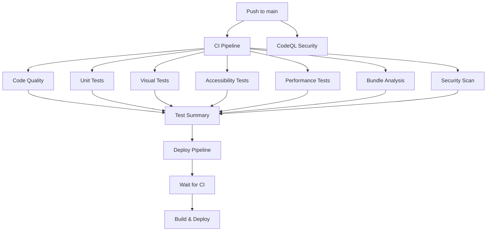

# CI/CD Pipeline Documentation

This document describes the comprehensive CI/CD pipeline for the Code198x website, designed to ensure quality, security, and reliability before deployment.

## Pipeline Overview

The CI/CD system consists of multiple workflows that provide comprehensive verification:



## Workflows

### 1. CI Pipeline (`.github/workflows/ci.yml`)

The main CI pipeline runs on every push to `main`/`develop` and all pull requests. It includes:

#### Code Quality Checks
- **Prettier formatting**: Ensures consistent code style
- **TypeScript checking**: Validates type safety with `astro check`
- **Build verification**: Confirms the site builds successfully
- **Vault data generation**: Verifies content collection processing

#### Unit Tests
- **Vitest execution**: Runs all unit tests with coverage
- **Coverage reporting**: Uploads results to Codecov
- **Test artifacts**: Preserves test results and coverage reports

#### Visual Regression Tests
- **Playwright testing**: Captures and compares screenshots across browsers
- **Multi-browser support**: Tests on Chromium, Firefox, and WebKit
- **Mobile/tablet testing**: Ensures responsive design consistency
- **Failure artifacts**: Preserves failed test screenshots for debugging

#### Accessibility Tests
- **A11y validation**: Automated accessibility testing with axe-core
- **WCAG compliance**: Ensures adherence to accessibility standards
- **Screen reader compatibility**: Validates assistive technology support

#### Performance Tests
- **Lighthouse CI**: Measures Core Web Vitals and performance metrics
- **Performance budgets**: Enforces performance standards
- **Progressive enhancement**: Validates graceful degradation

#### Bundle Analysis
- **Bundle size tracking**: Monitors JavaScript bundle sizes
- **Asset optimization**: Analyzes image and resource efficiency
- **Performance insights**: Identifies optimization opportunities

#### Security Scanning
- **npm audit**: Checks for vulnerable dependencies
- **Trivy scanning**: Security vulnerability detection
- **SARIF reporting**: Integrates with GitHub Security tab

### 2. Deployment Pipeline (`.github/workflows/deploy.yml`)

Enhanced deployment workflow that:
- **Waits for CI completion**: Only deploys after all CI checks pass
- **Builds production assets**: Creates optimized static site
- **Deploys to GitHub Pages**: Updates live site automatically

### 3. CodeQL Security Analysis (`.github/workflows/codeql.yml`)

Weekly security analysis that:
- **Scans for vulnerabilities**: Identifies security issues in code
- **Tracks security trends**: Monitors security posture over time
- **Automated alerts**: Notifies of critical security findings

## Test Categories

### Unit Tests (`npm run test:run`)
- Component functionality testing
- Utility function validation
- Data processing verification
- Mock and stub testing

### Visual Regression Tests (`npm run test:visual`)
- Page layout consistency
- Component rendering verification
- Cross-browser compatibility
- Responsive design validation

### Accessibility Tests (`npm run test:a11y`)
- Keyboard navigation testing
- Screen reader compatibility
- Color contrast validation
- ARIA attribute verification

### Performance Tests (`npm run lighthouse`)
- Core Web Vitals measurement
- Loading performance analysis
- SEO optimization checks
- Progressive Web App features

## Artifacts and Reports

Each workflow generates artifacts for debugging and analysis:

### Test Results
- Unit test coverage reports
- Visual regression comparison images
- Accessibility test findings
- Performance audit results

### Analysis Reports
- Bundle size analysis
- Security vulnerability reports
- Code quality metrics
- Performance recommendations

## Quality Gates

The pipeline enforces quality gates at multiple levels:

### Pre-deployment Requirements
- ✅ All tests must pass
- ✅ Code formatting must be correct
- ✅ TypeScript compilation must succeed
- ✅ Performance budgets must be met
- ✅ Security scans must show no critical issues
- ✅ Accessibility standards must be maintained

### Performance Budgets
- Initial page load: < 3 seconds
- First Contentful Paint: < 1.5 seconds
- Largest Contentful Paint: < 2.5 seconds
- Cumulative Layout Shift: < 0.1
- Bundle size: < 250KB gzipped

### Accessibility Standards
- WCAG 2.1 AA compliance
- Keyboard navigation support
- Screen reader compatibility
- Color contrast ratio > 4.5:1

## Local Development

### Running Tests Locally

```bash
# Run all tests
npm run test:all

# Individual test suites
npm run test:run           # Unit tests
npm run test:visual        # Visual regression
npm run test:a11y          # Accessibility
npm run lighthouse         # Performance

# Development helpers
npm run test:watch         # Watch mode for unit tests
npm run test:visual:debug  # Debug visual tests
npm run test:a11y:headed   # Debug accessibility tests
```

### Pre-commit Checklist

Before pushing code, ensure:

```bash
npm run format:check       # Code formatting
npx astro check           # TypeScript validation
npm run test:run          # Unit tests pass
npm run build             # Production build succeeds
```

## Monitoring and Alerts

### GitHub Integration
- Pull request status checks
- Security advisory notifications
- Dependency update alerts (Dependabot)
- Code review automation

### Performance Monitoring
- Lighthouse CI integration
- Core Web Vitals tracking
- Bundle size monitoring
- Performance regression detection

## Troubleshooting

### Common Issues

#### Test Failures
1. **Visual regression failures**: Review screenshots in artifacts
2. **Accessibility issues**: Check axe-core reports
3. **Performance degradation**: Analyze Lighthouse reports
4. **Unit test failures**: Review coverage reports

#### Build Issues
1. **TypeScript errors**: Run `npx astro check` locally
2. **Dependency conflicts**: Check `npm audit` output
3. **Bundle size increases**: Review bundle analysis
4. **Missing environment variables**: Check workflow configuration

### Debugging Steps

1. **Check workflow logs**: Review GitHub Actions output
2. **Download artifacts**: Examine test reports and screenshots
3. **Run tests locally**: Reproduce issues in development
4. **Review pull request**: Ensure all status checks pass

## Configuration Files

### Test Configuration
- `vitest.config.ts`: Unit test configuration
- `playwright.config.ts`: Visual and accessibility test setup
- `lighthouserc.json`: Performance test configuration

### CI Configuration
- `.github/workflows/ci.yml`: Main CI pipeline
- `.github/workflows/deploy.yml`: Deployment workflow
- `.github/workflows/codeql.yml`: Security analysis
- `.github/dependabot.yml`: Dependency updates
- `.github/codeql/codeql-config.yml`: CodeQL settings

## Best Practices

### Code Quality
- Write comprehensive tests for new features
- Follow established coding conventions
- Use TypeScript for type safety
- Maintain high test coverage (>80%)

### Performance
- Optimize images and assets
- Monitor bundle size growth
- Use lazy loading where appropriate
- Implement Progressive Web App features

### Accessibility
- Test with keyboard navigation
- Verify screen reader compatibility
- Maintain semantic HTML structure
- Ensure adequate color contrast

### Security
- Keep dependencies updated
- Review security alerts promptly
- Follow secure coding practices
- Regularly audit third-party packages

This comprehensive pipeline ensures that every change to the Code198x website maintains high standards for quality, performance, accessibility, and security.