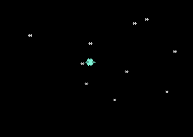

# First Hardware Sprite
**"I made a sprite appear and move!"**

Welcome to the magic of C64 hardware sprites! In this lesson, you'll create your first sprite and watch it glide smoothly across the screen. This is where you'll discover why the C64 became legendary for its smooth, arcade-quality graphics!

## The Magic You'll Create

**"Incredible! My sprite is moving by itself!"**

You're about to experience one of the most exciting moments in retro programming - creating your first hardware sprite! Watch as a yellow smiley face appears and moves smoothly across the screen, controlled entirely by the VIC-II chip working independently of your program.



## Why Sprites Were Revolutionary

**"This is how the C64 conquered the gaming world"**

In 1982, when other computers could barely move graphics without flickering, the C64's VIC-II chip could handle **8 independent hardware sprites** moving simultaneously at 50/60 frames per second. This was the secret weapon that made games like:
- **Impossible Mission** - Smooth character animation
- **Paradroid** - Multiple moving robots
- **Turrican** - Complex sprite-based effects
- **The Great Giana Sisters** - Flicker-free platforming

## Understanding Hardware Sprites

Before we create our moving sprite, let's understand this incredible technology:

### What Makes Hardware Sprites Special
**"The VIC-II chip does the work for us!"**

Unlike software-based graphics where your program has to draw every pixel, hardware sprites are handled entirely by the VIC-II chip:
- **Independent movement** - No CPU time needed for positioning
- **Automatic collision detection** - Hardware checks for sprite overlaps
- **Priority handling** - Sprites can appear behind or in front of each other
- **Smooth animation** - No flickering or tearing

### Sprite Specifications
Each C64 sprite is exactly:
- **24 pixels wide × 21 pixels tall**
- **Monochrome or multicolor** (we'll use monochrome first)
- **Any of 16 colors** from the C64 palette
- **Positioned anywhere** on the 320×200 screen (and beyond!)

### The Sprite System Architecture
```
VIC-II Sprite System:
- 8 hardware sprites (0-7)
- Each sprite: 63 bytes of data
- Sprite pointers: $07F8-$07FF
- Position registers: $D000-$D00F
- Control registers: $D010, $D015, $D017, etc.
```

## Building Your First Sprite

Let's create a sprite step by step, building on your Lesson 1 foundation!

### Step 1: The Sprite Data - Drawing in Binary
**"This is how we draw with pure data!"**

Our sprite data defines a 24×21 pixel image using binary patterns:

```assembly
sprite_data:
        ; A simple 24x21 sprite - a smiley face
        !byte %00000000, %11111111, %00000000  ; Row 1
        !byte %00000011, %11111111, %11000000  ; Row 2
        !byte %00001111, %11111111, %11110000  ; Row 3
        !byte %00011111, %11111111, %11111000  ; Row 4
        !byte %00111111, %11111111, %11111100  ; Row 5
        !byte %01111111, %11111111, %11111110  ; Row 6
        !byte %01111111, %11111111, %11111110  ; Row 7
        !byte %11111100, %11111111, %00111111  ; Row 8 (eyes)
        !byte %11111100, %11111111, %00111111  ; Row 9 (eyes)
        !byte %11111111, %11111111, %11111111  ; Row 10
        !byte %11111111, %11111111, %11111111  ; Row 11
        !byte %11111111, %11111111, %11111111  ; Row 12
        !byte %11111111, %11111111, %11111111  ; Row 13
        !byte %11111100, %00000000, %00111111  ; Row 14 (smile)
        !byte %11111100, %00000000, %00111111  ; Row 15 (smile)
        !byte %01111111, %00000000, %11111110  ; Row 16 (smile)
        !byte %01111111, %11111111, %11111110  ; Row 17
        !byte %00111111, %11111111, %11111100  ; Row 18
        !byte %00011111, %11111111, %11111000  ; Row 19
        !byte %00001111, %11111111, %11110000  ; Row 20
        !byte %00000011, %11111111, %11000000  ; Row 21
        !byte %00000000, %00000000, %00000000  ; Row 22 (padding)
```

**Magic Moment**: Each `%` represents a row of pixels - `1` = sprite color, `0` = transparent!

### Step 2: Setting Up Sprite Memory
**"This is how we tell the VIC-II where to find our sprite!"**

```assembly
setup_sprite:
        ; Set sprite 0 data pointer
        lda #$0d               ; Sprite data at $0340 (13 * 64)
        sta $07f8              ; Sprite 0 data pointer
        
        ; Copy sprite data to sprite memory
        ldx #0
copy_sprite:
        lda sprite_data,x      ; Load sprite data
        sta $0340,x            ; Store in sprite memory
        inx                    ; Next byte
        cpx #63                ; 63 bytes per sprite
        bne copy_sprite        ; Continue until done
        
        rts
```

**Magic Moment**: The sprite pointer at $07F8 tells VIC-II that sprite 0's data is at memory location $0340!

### Step 3: Enabling and Positioning the Sprite
**"This is where the magic happens - making it visible!"**

```assembly
        ; Enable sprite 0
        lda #$01               ; Enable sprite 0
        sta $d015              ; VIC-II sprite enable register
        
        ; Set sprite 0 color to yellow
        lda #$07               ; Yellow color
        sta $d027              ; VIC-II sprite 0 color register
        
        ; Set initial sprite position
        lda #100               ; X position (low byte)
        sta $d000              ; VIC-II sprite 0 X position
        lda #0                 ; X position (high bit)
        sta $d010              ; VIC-II sprite X MSB register
        
        lda #100               ; Y position
        sta $d001              ; VIC-II sprite 0 Y position
```

**Magic Moment**: The instant you set bit 0 of $D015, your sprite appears on screen!

### Step 4: Smooth Animation
**"This is how we make it move like a professional game!"**

```assembly
animate_sprite:
        ; Read current X position
        lda $d000              ; Get current X position
        clc                    ; Clear carry
        adc #1                 ; Add 1 to X position
        sta $d000              ; Store new X position
        
        ; Check if we need to handle X MSB
        cmp #$00               ; Did we wrap around?
        bne no_wrap            ; No, continue
        
        ; We wrapped, toggle X MSB
        lda $d010              ; Get X MSB register
        eor #$01               ; Toggle bit 0 (sprite 0 X MSB)
        sta $d010              ; Store back
        
no_wrap:
        ; Simple boundary check - reset if off screen
        lda $d000              ; Get X position
        cmp #$40               ; Compare with right edge
        bcc no_reset           ; If less, don't reset
        
        ; Check MSB too
        lda $d010              ; Get X MSB
        and #$01               ; Check sprite 0 MSB
        beq no_reset           ; If MSB=0, don't reset
        
        ; Reset sprite to left side
        lda #50                ; Start X position
        sta $d000              ; Store X position
        lda $d010              ; Get X MSB register
        and #$fe               ; Clear sprite 0 MSB
        sta $d010              ; Store back
        
no_reset:
        rts
```

**Magic Moment**: The sprite moves smoothly across the screen and wraps around automatically!

### Step 5: Perfect Timing
**"This is how we achieve professional-quality animation!"**

```assembly
wait_frame:
        ; Wait for raster line 250 (bottom of screen)
wait_raster:
        lda $d012              ; Read raster line
        cmp #250               ; Compare with line 250
        bne wait_raster        ; If not there, keep waiting
        rts
```

**Magic Moment**: By synchronizing with the raster beam, our animation is perfectly smooth!

## Create Your Moving Sprite

Now it's your turn to experience the magic of hardware sprites!

### Build Your First Sprite

1. **Create the complete program**: All code is in `pixel-patrol-02.asm`
2. **Build it**: Run `make clean && make all`
3. **Witness the magic**: Execute `make run`

### Expected Wonder

When you run this program, you'll see:
- Everything from Lesson 1 (blue background, white border, title text)
- A yellow smiley face sprite that appears instantly
- Smooth movement across the screen from left to right
- Automatic wraparound when the sprite reaches the edge
- **The incredible feeling of**: "I'm controlling dedicated graphics hardware!"

## Understanding the Magic

### Why This Is So Special
**"This is hardware acceleration from 1982!"**

What you've just accomplished is remarkable:
- **Zero CPU time** spent moving the sprite - it's all handled by VIC-II
- **Smooth 50/60 FPS** animation with no flickering
- **Pixel-perfect positioning** anywhere on screen
- **Automatic collision detection** (we'll use this later)
- **Professional game quality** from your first sprite program

### The VIC-II Advantage
The VIC-II chip is essentially a **graphics coprocessor** that handles:
- Sprite positioning and movement
- Color and priority management
- Collision detection
- Smooth scrolling
- Raster timing

## Make It Even More Amazing

Ready to experiment with your sprite? Try these variations:

### Challenge 1: Rainbow Sprite
**Wonder Goal**: "I can make any color sprite!"

Change the sprite color:
```assembly
lda #$02               ; Red sprite
sta $d027              ; Sprite 0 color register
```

Try all 16 colors: 0=Black, 1=White, 2=Red, 3=Cyan, 4=Purple, 5=Green, 6=Blue, 7=Yellow, 8=Orange, 9=Brown, 10=Light Red, 11=Dark Gray, 12=Medium Gray, 13=Light Green, 14=Light Blue, 15=Light Gray

### Challenge 2: Different Starting Position
**Wonder Goal**: "I can put my sprite anywhere!"

```assembly
lda #200               ; Start near right side
sta $d000              ; X position
lda #50                ; Start near top
sta $d001              ; Y position
```

### Challenge 3: Vertical Movement
**Wonder Goal**: "I can make it move any direction!"

Modify the animate_sprite routine to move the Y position:
```assembly
lda $d001              ; Get current Y position
clc                    ; Clear carry
adc #1                 ; Add 1 to Y position
sta $d001              ; Store new Y position
```

### Challenge 4: Custom Sprite Design
**Wonder Goal**: "I can draw anything as a sprite!"

Create your own sprite pattern! Try a simple rocket:
```assembly
sprite_data:
        !byte %00000000, %11111111, %00000000  ; Nose
        !byte %00000001, %11111111, %10000000  ; Body
        !byte %00000011, %11111111, %11000000  ; Body
        !byte %00000011, %11111111, %11000000  ; Body
        ; ... continue with your design
```

## What You've Achieved

🎉 **Congratulations!** You've mastered C64 hardware sprites!

### The Magic You Conquered
- ✨ **Hardware sprite creation** - You drew with pure data
- ✨ **VIC-II control** - You commanded the graphics chip directly
- ✨ **Smooth animation** - You achieved professional-quality movement
- ✨ **Memory management** - You organized sprite data efficiently
- ✨ **Raster synchronization** - You mastered professional timing
- ✨ **Coordinate systems** - You handled X/Y positioning and wraparound

### Your Programming Journey
You've just unlocked one of the most powerful features of the C64! Hardware sprites are what made legendary games possible. Every smooth character, every moving enemy, every animated effect you've ever admired in C64 games started with exactly what you just learned.

### Historical Achievement
You've mastered the same technique used by legendary programmers like:
- **Jeff Minter** (Llamasoft) - for his psychedelic sprite effects
- **Andrew Braybrook** (Paradroid, Uridium) - for smooth character movement
- **Martin Walker** (Turrican series) - for complex sprite-based effects

### Modern Relevance
The concepts you learned today are fundamental to:
- **Modern GPU programming** - Hardware acceleration and sprite rendering
- **Game engines** - Sprite systems and animation
- **Computer graphics** - Hardware acceleration and parallel processing
- **Embedded systems** - Efficient graphics programming

## What's Next?

**"Ready to take control of your sprite?"**

In the next lesson, you'll discover how to control your sprite with a joystick! If you thought watching a sprite move automatically was exciting, wait until you experience the thrill of direct, responsive control of your hardware sprite.

### Coming Up
- Connect a joystick to your C64 (or use keyboard controls)
- Read joystick input directly from hardware
- Control your sprite in real-time
- Create responsive, arcade-quality movement
- Build the foundation for interactive games

You're about to transform from a spectator to a player - your sprite will respond to your every command!

**Ready to take the controls?** Let's make your sprite interactive!

---

## Technical Reference

### VIC-II Sprite Registers
- **$D000-$D001**: Sprite 0 X/Y position
- **$D002-$D003**: Sprite 1 X/Y position
- **...up to $D00E-$D00F**: Sprite 7 X/Y position
- **$D010**: Sprite X MSB register (for X positions > 255)
- **$D015**: Sprite enable register (bit 0 = sprite 0, etc.)
- **$D027-$D02E**: Sprite 0-7 color registers

### Sprite Memory Layout
- **Sprite pointers**: $07F8-$07FF (screen memory + $3F8)
- **Sprite data**: 64-byte blocks (63 bytes data + 1 byte padding)
- **Data format**: 24×21 pixels = 63 bytes (3 bytes per row)

### Sprite Coordinates
- **X position**: 0-511 (uses MSB register for > 255)
- **Y position**: 0-255
- **Screen area**: 320×200 visible pixels
- **Sprite boundaries**: Can extend beyond screen edges

### Animation Timing
- **Raster line**: Current beam position ($D012)
- **Frame rate**: 50Hz (PAL) or 60Hz (NTSC)
- **VBlank**: Vertical blanking interval
- **Smooth animation**: Synchronize updates with raster beam

This foundation in hardware sprites will serve you throughout your C64 programming journey!