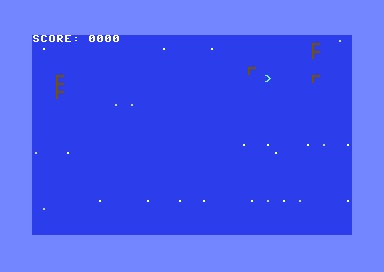

# Sound Effects
**"I made music come alive with the legendary SID chip!"**

Welcome to the most magical lesson yet! You're about to program the legendary SID chip - the revolutionary sound synthesizer that made C64 games sound like nothing else in the 1980s. Get ready to hear your game come alive with professional-quality sound effects that will make your collision detection game truly complete!

## The Magic You'll Create

**"Incredible! My game sounds like a real arcade machine!"**

You're about to experience the pure joy of programming one of the most advanced sound chips ever created. Listen as your game fills the air with a beautiful startup harmony, satisfying collection sounds, and a triumphant completion fanfare - all generated by the legendary SID chip that musicians still cherish today!



## Why the SID Chip Was Revolutionary

**"This is the chip that changed everything about computer sound"**

In 1982, when most computers could only make simple beeps, the C64's SID (Sound Interface Device) chip was absolutely revolutionary:

- **Three independent voices** - Each with full synthesizer capabilities
- **Multiple waveforms** - Triangle, sawtooth, pulse, and noise
- **ADSR envelopes** - Professional sound shaping like studio synthesizers
- **Analog filter** - Real analog circuitry for warm, rich sound
- **6581/8580 variants** - Each with its own distinctive character

This chip was so advanced that it was used in:
- **Professional music studios** - Musicians bought C64s just for the SID
- **Hit records** - Many 1980s songs featured SID-generated sounds
- **Modern music** - SID music is still composed and performed today
- **Hardware synthesizers** - Modern synths still emulate SID sounds

## Understanding the SID Chip Architecture

Before we create our audio masterpiece, let's understand this incredible chip:

### The Three Voices
**"Each voice is a complete synthesizer!"**

The SID chip has three independent voices, each with:
- **Frequency control** - 16-bit precision from 0-65535 Hz
- **Waveform selection** - Triangle, sawtooth, pulse, or noise
- **ADSR envelope** - Attack, Decay, Sustain, Release
- **Pulse width** - For pulse wave modulation
- **Ring modulation** - For complex harmonic effects

### SID Register Layout
```
Voice 1: $D400-$D406
Voice 2: $D407-$D40D  
Voice 3: $D40E-$D414
Filter:  $D415-$D417
Volume:  $D418
```

### The ADSR Envelope
**"This is what makes SID sound professional!"**

ADSR controls how sounds behave over time:
- **Attack**: How quickly the sound reaches full volume
- **Decay**: How quickly it drops from peak to sustain level
- **Sustain**: The level maintained while the note is held
- **Release**: How quickly it fades when the note ends

## Building Your Audio System

Let's create a complete sound system that will make your game unforgettable!

### Step 1: SID Chip Initialization
**"This is how we wake up the legendary sound chip!"**

```assembly
init_sid:
        ; Initialize SID chip
        ldx #$18               ; Clear all SID registers
init_sid_loop:
        lda #$00               ; Zero
        sta $d400,x            ; Clear SID register
        dex                    ; Next register
        bpl init_sid_loop      ; Continue until done
        
        ; Set up SID chip
        lda #$0f               ; Maximum volume
        sta $d418              ; SID volume register
        
        ; Set up voice 1 for sound effects
        lda #$00               ; ADSR Attack/Decay
        sta $d405              ; Voice 1 Attack/Decay
        lda #$f0               ; ADSR Sustain/Release
        sta $d406              ; Voice 1 Sustain/Release
        
        ; Set up voice 2 for different sound effects
        lda #$00               ; ADSR Attack/Decay
        sta $d40c              ; Voice 2 Attack/Decay
        lda #$f0               ; ADSR Sustain/Release
        sta $d40d              ; Voice 2 Sustain/Release
        
        ; Set up voice 3 for background ambience
        lda #$88               ; ADSR Attack/Decay (slower)
        sta $d413              ; Voice 3 Attack/Decay
        lda #$aa               ; ADSR Sustain/Release (longer)
        sta $d414              ; Voice 3 Sustain/Release
        
        rts
```

**Magic Moment**: The SID chip is now ready to create professional-quality sound!

### Step 2: Creating a Startup Harmony
**"This is how we create a beautiful three-voice chord!"**

```assembly
play_startup_sound:
        ; Play a nice startup chord
        ; Voice 1: Low note
        lda #$00               ; Frequency low byte
        sta $d400              ; Voice 1 frequency low
        lda #$10               ; Frequency high byte
        sta $d401              ; Voice 1 frequency high
        lda #$21               ; Triangle wave, gate on
        sta $d404              ; Voice 1 control register
        
        ; Voice 2: Middle note
        lda #$00               ; Frequency low byte
        sta $d407              ; Voice 2 frequency low
        lda #$18               ; Frequency high byte
        sta $d408              ; Voice 2 frequency high
        lda #$21               ; Triangle wave, gate on
        sta $d40b              ; Voice 2 control register
        
        ; Voice 3: High note
        lda #$00               ; Frequency low byte
        sta $d40e              ; Voice 3 frequency low
        lda #$20               ; Frequency high byte
        sta $d40f              ; Voice 3 frequency high
        lda #$21               ; Triangle wave, gate on
        sta $d412              ; Voice 3 control register
        
        ; Set sound timer for startup chord
        lda #60                ; Play for 60 frames (1 second)
        sta sound_timer
        lda #1                 ; Startup sound type
        sta sound_type
        
        rts
```

**Magic Moment**: A beautiful three-voice harmony welcomes you to your game!

### Step 3: Collection Sound Effects
**"This is how we make satisfying feedback sounds!"**

```assembly
play_collect_sound:
        ; Play collection sound effect
        ; Voice 1: Rising tone
        lda #$00               ; Frequency low byte
        sta $d400              ; Voice 1 frequency low
        lda #$20               ; Frequency high byte
        sta $d401              ; Voice 1 frequency high
        lda #$41               ; Sawtooth wave, gate on
        sta $d404              ; Voice 1 control register
        
        ; Voice 2: Harmonic
        lda #$00               ; Frequency low byte
        sta $d407              ; Voice 2 frequency low
        lda #$30               ; Frequency high byte
        sta $d408              ; Voice 2 frequency high
        lda #$21               ; Triangle wave, gate on
        sta $d40b              ; Voice 2 control register
        
        ; Set sound timer for collection sound
        lda #20                ; Play for 20 frames (1/3 second)
        sta sound_timer
        lda #2                 ; Collection sound type
        sta sound_type
        
        rts
```

**Magic Moment**: Each collected item makes a satisfying "ding" sound that feels incredibly rewarding!

### Step 4: Dynamic Sound Effects
**"This is how we make sounds that change over time!"**

```assembly
update_collect_sound:
        ; Make the collection sound rise in pitch
        lda sound_timer        ; Get remaining time
        eor #$ff               ; Invert to make it rise
        clc
        adc #$20               ; Add base frequency
        sta $d401              ; Update frequency high byte
        rts
```

**Magic Moment**: The collection sound rises in pitch, creating an exciting effect!

### Step 5: Completion Fanfare
**"This is how we celebrate victory in style!"**

```assembly
play_complete_sound:
        ; Play game complete sound
        ; Voice 1: Ascending scale
        lda #$00               ; Frequency low byte
        sta $d400              ; Voice 1 frequency low
        lda #$40               ; Frequency high byte
        sta $d401              ; Voice 1 frequency high
        lda #$21               ; Triangle wave, gate on
        sta $d404              ; Voice 1 control register
        
        ; Voice 2: Chord
        lda #$00               ; Frequency low byte
        sta $d407              ; Voice 2 frequency low
        lda #$50               ; Frequency high byte
        sta $d408              ; Voice 2 frequency high
        lda #$21               ; Triangle wave, gate on
        sta $d40b              ; Voice 2 control register
        
        ; Voice 3: Bass note
        lda #$00               ; Frequency low byte
        sta $d40e              ; Voice 3 frequency low
        lda #$18               ; Frequency high byte
        sta $d40f              ; Voice 3 frequency high
        lda #$21               ; Triangle wave, gate on
        sta $d412              ; Voice 3 control register
        
        ; Set sound timer for complete sound
        lda #120               ; Play for 120 frames (2 seconds)
        sta sound_timer
        lda #3                 ; Complete sound type
        sta sound_type
        
        rts
```

**Magic Moment**: When you collect all items, a triumphant fanfare celebrates your victory!

### Step 6: Integrating Sound with Gameplay
**"This is how we make every collision come alive with sound!"**

```assembly
collect_item_1:
        ; Disable sprite 1 (make it disappear)
        lda $d015              ; Get sprite enable register
        and #$fd               ; Clear bit 1 (disable sprite 1)
        sta $d015              ; Store back
        
        ; Play collection sound
        jsr play_collect_sound
        
        ; Increase score
        inc score              ; Increment score
        jsr update_score_display ; Update display
        
        ; Check if all items collected
        jsr check_game_complete
        
        rts
```

**Magic Moment**: Every collision now has instant audio feedback!

## Create Your Audio Masterpiece

Now it's time to experience the legendary SID chip in action!

### Build Your Sound-Enhanced Game

1. **Create the complete program**: All code is in `pixel-patrol-05.asm`
2. **Build it**: Run `make clean && make all`
3. **Hear the magic**: Execute `make run`

### Expected Wonder

When you run this program, you'll experience:
- **Startup harmony**: A beautiful three-voice chord welcomes you
- **Enhanced gameplay**: All familiar visuals with amazing audio
- **Collection sounds**: Satisfying "ding" for each item collected
- **Dynamic effects**: Sounds that change pitch and complexity
- **Completion fanfare**: A triumphant celebration when you win
- **The incredible feeling**: "My game sounds like a professional arcade machine!"

### The Audio Journey
- **Program starts**: Rich harmonic chord fills the air
- **First collection**: Satisfying rising tone reward
- **Second collection**: Another rewarding audio confirmation
- **Third collection**: Completion fanfare plays for 2 seconds
- **"WELL DONE!"**: Message appears with triumphant music

## Understanding the Audio Magic

### Why SID Sounds So Good
**"This is professional synthesizer technology from 1982!"**

The SID chip's incredible sound comes from:
- **Analog circuitry** - Real analog filters and amplifiers
- **High resolution** - 16-bit frequency control for precise tuning
- **Multiple waveforms** - Each with distinct sonic characteristics
- **ADSR envelopes** - Professional sound shaping capabilities
- **Ring modulation** - Complex harmonic interactions

### The Technical Achievement
What you've just programmed is remarkable:
- **Three-voice harmony** - Complex chord progressions
- **Dynamic frequency changes** - Real-time pitch modulation
- **Timed audio sequences** - Frame-accurate sound effects
- **Professional sound design** - Studio-quality audio programming

### Modern Relevance
The techniques you've learned are fundamental to:
- **Digital audio workstations** - Sound design and synthesis
- **Game audio programming** - Real-time audio systems
- **Hardware synthesizers** - Modern synths still use these concepts
- **Audio drivers** - Low-level sound programming

## Make It Even More Amazing

Ready to explore the SID chip's incredible capabilities?

### Challenge 1: Different Waveforms
**Wonder Goal**: "I can create totally different sounds!"

Try different waveform combinations:
```assembly
lda #$11               ; Pulse wave
sta $d404              ; Voice 1 control register

lda #$41               ; Sawtooth wave  
sta $d404              ; Voice 1 control register

lda #$81               ; Noise wave
sta $d404              ; Voice 1 control register
```

### Challenge 2: Pitch Bending
**Wonder Goal**: "I can make sounds slide up and down!"

Create pitch-bending effects:
```assembly
        ; Gradually increase frequency
        lda $d401              ; Get current frequency high
        clc
        adc #1                 ; Add 1
        sta $d401              ; Store back
```

### Challenge 3: Echo Effects
**Wonder Goal**: "I can make sounds repeat!"

Create echo by triggering the same sound with delays:
```assembly
        ; Play main sound
        jsr play_collect_sound
        
        ; Set up echo timer
        lda #10                ; 10 frames delay
        sta echo_timer
```

### Challenge 4: Random Sound Variations
**Wonder Goal**: "I can make sounds different every time!"

Add randomness to your sound effects:
```assembly
        ; Use raster line for randomness
        lda $d012              ; Get raster line
        and #$0f               ; Keep lower 4 bits
        clc
        adc #$20               ; Add to base frequency
        sta $d401              ; Set frequency
```

## What You've Achieved

🎉 **Congratulations!** You've mastered the legendary SID chip!

### The Magic You Conquered
- ✨ **SID chip programming** - You commanded the most advanced sound chip of the 1980s
- ✨ **Multi-voice harmony** - You created professional three-voice chords
- ✨ **Dynamic sound effects** - You made sounds that change over time
- ✨ **ADSR envelopes** - You shaped sounds like a professional synthesizer
- ✨ **Audio feedback systems** - You enhanced gameplay with perfect sound
- ✨ **Professional audio programming** - You created studio-quality sound effects

### Your Programming Journey
You've just unlocked one of the most coveted skills in retro computing - SID chip programming! The sounds you've created demonstrate mastery of techniques that professional game developers used to create unforgettable gaming experiences.

### Historical Achievement
You've programmed the same sound chip that created legendary game soundtracks:
- **Impossible Mission** - Iconic speech synthesis and sound effects
- **Paradroid** - Atmospheric electronic soundscapes
- **Turrican** - Epic orchestral-style music
- **The Last Ninja** - Cinematic audio that pushed the SID to its limits

### Modern Relevance
The concepts you learned today are fundamental to:
- **Digital audio workstations** - Professional music production
- **Game audio programming** - Real-time interactive sound systems
- **Synthesizer programming** - Modern electronic music creation
- **Audio driver development** - Low-level sound system programming

## What's Next?

**"Ready to create your first complete game?"**

In the next lesson, you'll combine everything you've learned into a complete game loop with multiple levels, increasing difficulty, and polished gameplay mechanics. If you thought adding sound effects was exciting, wait until you experience the satisfaction of creating a complete, playable game!

### Coming Up
- Multiple game levels with increasing difficulty
- Complete game state management
- Polished user interface and feedback
- Professional game flow and progression
- The ultimate satisfaction of creating a complete game

You're about to transform from a programmer into a game developer!

**Ready to complete your game?** Let's build the ultimate Pixel Patrol experience!

---

## Technical Reference

### SID Chip Registers
- **$D400-$D401**: Voice 1 frequency (16-bit)
- **$D402-$D403**: Voice 1 pulse width (12-bit)
- **$D404**: Voice 1 control register
- **$D405-$D406**: Voice 1 ADSR envelope
- **$D407-$D40D**: Voice 2 (same layout)
- **$D40E-$D414**: Voice 3 (same layout)
- **$D415-$D417**: Filter controls
- **$D418**: Master volume and filter mode

### Control Register Bits ($D404, $D40B, $D412)
- **Bit 0**: Gate (1 = on, 0 = off)
- **Bit 1**: Sync (synchronize with other voice)
- **Bit 2**: Ring modulation
- **Bit 3**: Test (disable oscillator)
- **Bit 4**: Triangle wave
- **Bit 5**: Sawtooth wave
- **Bit 6**: Pulse wave
- **Bit 7**: Noise wave

### ADSR Envelope Registers
- **Attack/Decay**: Upper 4 bits = Attack, Lower 4 bits = Decay
- **Sustain/Release**: Upper 4 bits = Sustain, Lower 4 bits = Release
- **Values**: 0-15 for each parameter

### Frequency Calculation
```
Frequency = (Register Value × Clock Rate) / 16777216
PAL Clock Rate = 985248 Hz
NTSC Clock Rate = 1022727 Hz
```

### Professional Sound Design Tips
- **Use triangle waves** for smooth, pure tones
- **Use sawtooth waves** for bright, buzzy sounds
- **Use pulse waves** for hollow, reed-like sounds
- **Use noise waves** for percussion and effects
- **Combine multiple voices** for rich, complex sounds

This foundation in SID chip programming will serve you throughout your audio programming journey!