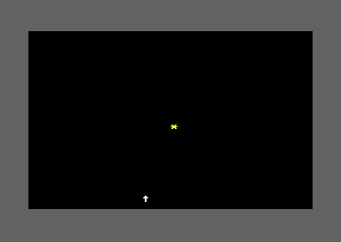

## Introduction

The player can move smoothly. Now let's add the core gameplay: falling objects to catch.

By the end of this lesson, you'll have one object falling from top to bottom that the player can watch.

## Object Data Structure

The player only needed to track their column (row was always 23). Objects need to track BOTH row and column since they move vertically:

```asm
; Add to variables section
OBJ_COL = $04                  ; Object column (0-39)
OBJ_ROW = $05                  ; Object row (0-24)
OBJ_ACTIVE = $06               ; Is object falling? (0=no, 1=yes)
```

Three bytes of zero page track one falling object's state.

## Choosing the Object Character

```asm
; Add to constants
OBJECT_CHAR = $2a              ; Asterisk *
OBJECT_COLOR = $07             ; Yellow
```

Yellow asterisks will be clearly visible against the black background and distinct from the white player character.

## Calculating 2D Screen Positions

The player always draws at row 23, so we used:

```asm
sta SCREEN_RAM + (PLAYER_ROW * 40),x    ; where X = column
```

But objects can be at ANY row. We need to calculate: **SCREEN_RAM + (row × 40) + column**

The assembler can't help us - it doesn't know the row at runtime. We need to calculate row × 40 in assembly.

## Multiplying by 40

The 6502 has no multiply instruction. We use bit shifts (which are multiplies by 2):

**row × 40 = (row × 32) + (row × 8)**

Because 32 + 8 = 40.

<div class="code-block">
<div class="code-block-header">Row × 40 Calculation</div>

```asm
; Calculate row * 40
; Input: row in A
; Output: result in A (low byte)

calc_row_times_40:
    ; Save original row value
    sta $fb                    ; $fb = row

    ; Multiply by 8: shift left 3 times
    asl                        ; row * 2
    asl                        ; row * 4
    asl                        ; row * 8
    sta $fc                    ; $fc = row * 8

    ; Multiply by 32: shift left 5 times
    lda $fb                    ; Get original row
    asl                        ; row * 2
    asl                        ; row * 4
    asl                        ; row * 8
    asl                        ; row * 16
    asl                        ; row * 32

    ; Add them together: (row * 32) + (row * 8)
    clc
    adc $fc                    ; A = (row * 32) + (row * 8) = row * 40
    rts
```
</div>

<div class="note">
<div class="note-title">💡 Example: Row 5</div>

- 5 × 8 = 40
- 5 × 32 = 160
- 40 + 160 = 200 ✓
</div>

## Drawing the Object

Now we can draw at any row/column:

<div class="code-block">
<div class="code-block-header">Object Drawing</div>

```asm
draw_object:
    ; Calculate screen offset
    lda OBJ_ROW
    jsr calc_row_times_40      ; A = row * 40

    clc
    adc OBJ_COL                ; A = (row * 40) + column
    tax                        ; Put offset in X

    ; Draw character
    lda #OBJECT_CHAR
    sta SCREEN_RAM,x

    ; Draw color
    lda #OBJECT_COLOR
    sta COLOR_RAM,x
    rts

erase_object:
    ; Same calculation
    lda OBJ_ROW
    jsr calc_row_times_40
    clc
    adc OBJ_COL
    tax

    lda #$20                   ; Space
    sta SCREEN_RAM,x
    rts
```
</div>

## Spawning an Object

Create one object at the top center when the game starts:

```asm
spawn_object:
    lda #$01
    sta OBJ_ACTIVE             ; Mark as active

    lda #$00
    sta OBJ_ROW                ; Start at top row

    lda #20
    sta OBJ_COL                ; Start at center column

    jsr draw_object            ; Draw it
    rts
```

Call from main:

```asm
main:
    jsr init_screen

    lda #PLAYER_START_COL
    sta PLAYER_COL
    lda #3
    sta MOVE_COUNTER

    jsr draw_player
    jsr spawn_object           ; Add this

game_loop:
    ; ...
```

## Making It Fall

Objects fall every few frames. Add a counter:

```asm
; Add to variables
FALL_COUNTER = $07             ; Frames until next fall

; Initialize in main (before game_loop)
    lda #5                     ; Fall every 5 frames
    sta FALL_COUNTER
```

Update the game loop:

```asm
game_loop:
    jsr wait_for_raster

    ; Player movement (every 3 frames)
    dec MOVE_COUNTER
    bne skip_player_movement
    lda #3
    sta MOVE_COUNTER
    jsr check_keys
skip_player_movement:

    ; Object falling (every 5 frames)
    dec FALL_COUNTER
    bne skip_object_fall
    lda #5
    sta FALL_COUNTER
    jsr update_object
skip_object_fall:

    jmp game_loop
```

## Update Object Logic

```asm
update_object:
    lda OBJ_ACTIVE
    beq done_update            ; Skip if not active

    jsr erase_object           ; Erase old position

    inc OBJ_ROW                ; Move down one row

    lda OBJ_ROW
    cmp #24                    ; Reached bottom row?
    bne still_falling

    ; Hit bottom - deactivate
    lda #$00
    sta OBJ_ACTIVE
    rts

still_falling:
    jsr draw_object            ; Draw at new position

done_update:
    rts
```

## Complete Lesson 9 Code

<div class="code-block">
<div class="code-block-header">skyfall.asm - Complete</div>

```asm
; SKYFALL - Lesson 9
; Creating falling objects

* = $0801

; BASIC stub: SYS 2061
!byte $0c,$08,$0a,$00,$9e
!byte $32,$30,$36,$31          ; "2061" in ASCII
!byte $00,$00,$00

* = $080d

; ===================================
; Constants
; ===================================
SCREEN_RAM = $0400
COLOR_RAM = $d800
VIC_BORDER = $d020
VIC_BACKGROUND = $d021
CIA1_PORT_A = $dc01
CIA1_PORT_B = $dc00
VIC_RASTER = $d012

BLACK = $00
WHITE = $01
YELLOW = $07
DARK_GREY = $0b

PLAYER_CHAR = $1e
PLAYER_COLOR = WHITE
PLAYER_ROW = 23
PLAYER_START_COL = 20

OBJECT_CHAR = $2a
OBJECT_COLOR = YELLOW

; Variables
PLAYER_COL = $02
MOVE_COUNTER = $03
OBJ_COL = $04
OBJ_ROW = $05
OBJ_ACTIVE = $06
FALL_COUNTER = $07

; ===================================
; Main Program
; ===================================
main:
    jsr init_screen

    lda #PLAYER_START_COL
    sta PLAYER_COL

    lda #3
    sta MOVE_COUNTER

    lda #5
    sta FALL_COUNTER

    jsr draw_player
    jsr spawn_object

game_loop:
    jsr wait_for_raster

    ; Player movement (every 3 frames)
    dec MOVE_COUNTER
    bne skip_player_movement
    lda #3
    sta MOVE_COUNTER
    jsr check_keys
skip_player_movement:

    ; Object falling (every 5 frames)
    dec FALL_COUNTER
    bne skip_object_fall
    lda #5
    sta FALL_COUNTER
    jsr update_object
    jsr draw_player           ; Redraw player (in case object erased it)
skip_object_fall:

    jmp game_loop

; ===================================
; Subroutines
; ===================================

wait_for_raster:
    lda VIC_RASTER
    cmp #250
    bne wait_for_raster
    rts

init_screen:
    jsr wait_for_raster
    lda #BLACK
    sta VIC_BACKGROUND
    lda #DARK_GREY
    sta VIC_BORDER
    jsr clear_screen
    rts

clear_screen:
    lda #$20
    ldx #$00
clear_screen_loop:
    sta SCREEN_RAM,x
    sta SCREEN_RAM + $100,x
    sta SCREEN_RAM + $200,x
    sta SCREEN_RAM + $300,x
    inx
    bne clear_screen_loop

    lda #WHITE
    ldx #$00
clear_color_loop:
    sta COLOR_RAM,x
    sta COLOR_RAM + $100,x
    sta COLOR_RAM + $200,x
    sta COLOR_RAM + $300,x
    inx
    bne clear_color_loop
    rts

check_keys:
    ; Check D key (column 2, row 2)
    lda #%11111011
    sta CIA1_PORT_B
    lda CIA1_PORT_A
    and #%00000100
    beq move_right

    ; Check A key (column 1, row 2)
    lda #%11111101
    sta CIA1_PORT_B
    lda CIA1_PORT_A
    and #%00000100
    beq move_left

    rts

move_left:
    lda PLAYER_COL
    beq skip_left

    jsr erase_player
    dec PLAYER_COL
    jsr draw_player

skip_left:
    rts

move_right:
    lda PLAYER_COL
    cmp #39
    beq skip_right

    jsr erase_player
    inc PLAYER_COL
    jsr draw_player

skip_right:
    rts

erase_player:
    ldx PLAYER_COL
    lda #$20
    sta SCREEN_RAM + (PLAYER_ROW * 40),x
    rts

draw_player:
    ldx PLAYER_COL
    lda #PLAYER_CHAR
    sta SCREEN_RAM + (PLAYER_ROW * 40),x

    lda #PLAYER_COLOR
    sta COLOR_RAM + (PLAYER_ROW * 40),x
    rts

spawn_object:
    lda #$01
    sta OBJ_ACTIVE

    lda #$00
    sta OBJ_ROW

    lda #20
    sta OBJ_COL

    jsr draw_object
    rts

update_object:
    lda OBJ_ACTIVE
    beq done_update

    jsr erase_object

    inc OBJ_ROW

    lda OBJ_ROW
    cmp #24
    bne still_falling

    lda #$00
    sta OBJ_ACTIVE
    rts

still_falling:
    jsr draw_object

done_update:
    rts

; Row offset lookup table (low bytes)
row_offset_lo:
    !byte <(0*40), <(1*40), <(2*40), <(3*40), <(4*40)
    !byte <(5*40), <(6*40), <(7*40), <(8*40), <(9*40)
    !byte <(10*40), <(11*40), <(12*40), <(13*40), <(14*40)
    !byte <(15*40), <(16*40), <(17*40), <(18*40), <(19*40)
    !byte <(20*40), <(21*40), <(22*40), <(23*40), <(24*40)

; Row offset lookup table (high bytes)
row_offset_hi:
    !byte >(0*40), >(1*40), >(2*40), >(3*40), >(4*40)
    !byte >(5*40), >(6*40), >(7*40), >(8*40), >(9*40)
    !byte >(10*40), >(11*40), >(12*40), >(13*40), >(14*40)
    !byte >(15*40), >(16*40), >(17*40), >(18*40), >(19*40)
    !byte >(20*40), >(21*40), >(22*40), >(23*40), >(24*40)

draw_object:
    ; Get row offset from table
    ldx OBJ_ROW
    lda row_offset_lo,x
    sta $fb
    lda row_offset_hi,x
    sta $fc

    ; Add column
    lda $fb
    clc
    adc OBJ_COL
    sta $fb
    bcc +
    inc $fc
+
    ; Add SCREEN_RAM base
    lda $fb
    clc
    adc #<SCREEN_RAM
    sta $fb
    lda $fc
    adc #>SCREEN_RAM
    sta $fc

    ; Draw character
    ldy #0
    lda #OBJECT_CHAR
    sta ($fb),y

    ; Calculate COLOR_RAM address
    lda $fb
    clc
    adc #<(COLOR_RAM-SCREEN_RAM)
    sta $fb
    lda $fc
    adc #>(COLOR_RAM-SCREEN_RAM)
    sta $fc

    ; Draw color
    lda #OBJECT_COLOR
    sta ($fb),y
    rts

erase_object:
    ; Get row offset from table
    ldx OBJ_ROW
    lda row_offset_lo,x
    sta $fb
    lda row_offset_hi,x
    sta $fc

    ; Add column
    lda $fb
    clc
    adc OBJ_COL
    sta $fb
    bcc +
    inc $fc
+
    ; Add SCREEN_RAM base
    lda $fb
    clc
    adc #<SCREEN_RAM
    sta $fb
    lda $fc
    adc #>SCREEN_RAM
    sta $fc

    ; Erase with space
    ldy #0
    lda #$20
    sta ($fb),y
    rts
```
</div>

Build and run. Watch the yellow asterisk fall from top to bottom at column 20!

{/* TODO: Add screenshot when available

*/}

## New Concepts

### Opcodes Used in This Lesson

**asl** - Arithmetic Shift Left
- Shifts all bits left by one position
- Bottom bit becomes 0, top bit goes to carry flag
- Effect: multiplies by 2
- Example: `asl` on value 5 ($05 = %00000101) gives 10 ($0A = %00001010)

### Why Shifting Multiplies by 2

If you're wondering WHY `asl` multiplies by 2, here's the key insight:

Binary numbers work like decimal, but with powers of 2 instead of powers of 10.

**Bit Position Values (8-bit):**
```
Bit:     7   6   5   4   3   2   1   0
Value: 128  64  32  16   8   4   2   1
```

**Example: The number 5**
```
Bit:     7   6   5   4   3   2   1   0
Value: 128  64  32  16   8   4   2   1
Binary:  0   0   0   0   0   1   0   1  = 5 (4 + 1)

After ASL (shift left):
Binary:  0   0   0   0   1   0   1   0  = 10 (8 + 2)
```

Shifting left moves each bit to a higher power of 2, which multiplies the value by 2.

**Example with 5:**
```
%00000101  = 5
%00001010  = 10   (after one asl)
%00010100  = 20   (after two asl)
%00101000  = 40   (after three asl)
```

This is why computers are so good at multiplying by powers of 2 - it's just moving bits around, not actual arithmetic.

### The Power of Bit Shifting

Multiplying by powers of 2 is trivial with shifting:
- `asl` once = × 2
- `asl` twice = × 4
- `asl` three times = × 8
- `asl` five times = × 32

Since 40 = 32 + 8, we calculate both and add them.

### Why Not a Lookup Table?

You might wonder: why not pre-calculate all 25 row offsets and look them up?

Answer: We could! That would be faster but uses 25 bytes of memory. The calculation is fast enough for Skyfall and teaches you how to do runtime math.

Later games with more objects might use a table. It's a speed/memory tradeoff.

### Object Lifecycle

Objects have a lifecycle:
1. **Spawn** - Created with initial position and marked active
2. **Update** - Position changes each frame
3. **Deactivate** - Marked inactive when reaching bottom (or caught)
4. **Respawn** - Can be reused by spawning again

This pattern scales to many objects (coming in Lesson 12).

<div class="exercise">
<div class="exercise-title">🎯 Your Tasks</div>

1. **Build and run** - Watch the object fall
2. **Change fall speed** - Try different FALL_COUNTER values (3, 7, 10)
3. **Change spawn position** - Try different starting columns
4. **Verify the math** - Calculate row 10 × 40 by hand, verify it's 400

</div>

## Next Steps

You now have a falling object! The core gameplay element is in place.

In Lesson 10, we'll add collision detection so the player can actually catch the falling object!