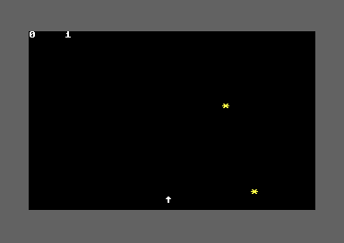

## Introduction

One object at a time is manageable. But real arcade games have multiple objects on screen simultaneously.

By the end of this lesson, Skyfall will have up to 4 objects falling at once!

## The Array Approach

Currently we have:

```asm
OBJ_COL = $04
OBJ_ROW = $05
OBJ_ACTIVE = $06
```

For multiple objects, we need arrays:

```asm
; 4 objects × 3 bytes each = 12 bytes
OBJ_COL_ARRAY = $10        ; Columns for objects 0-3
OBJ_ROW_ARRAY = $14        ; Rows for objects 0-3
OBJ_ACTIVE_ARRAY = $18     ; Active flags for objects 0-3
```

<div class="note">
<div class="note-title">💡 Memory Layout</div>

```
$10: Object 0 column    $14: Object 0 row    $18: Object 0 active
$11: Object 1 column    $15: Object 1 row    $19: Object 1 active
$12: Object 2 column    $16: Object 2 row    $1A: Object 2 active
$13: Object 3 column    $17: Object 3 row    $1B: Object 3 active
```
</div>

## Initializing the Arrays

Clear all objects at startup:

```asm
; In main, after initializing other variables
    ; Clear all objects
    ldx #$00
clear_objects:
    lda #$00
    sta OBJ_ACTIVE_ARRAY,x
    inx
    cpx #4                     ; 4 objects
    bne clear_objects
```

## Spawning with an Index

We need to find an inactive object slot:

<div class="code-block">
<div class="code-block-header">Spawn Object</div>

```asm
spawn_object:
    ; Find first inactive object
    ldx #$00
find_slot:
    lda OBJ_ACTIVE_ARRAY,x
    beq found_slot             ; Found inactive slot
    inx
    cpx #4
    bne find_slot
    rts                        ; No free slots, return

found_slot:
    ; X now holds the object index
    lda #$01
    sta OBJ_ACTIVE_ARRAY,x     ; Mark as active

    lda #$00
    sta OBJ_ROW_ARRAY,x        ; Start at top

    ; Save X for later
    stx $fd

    jsr get_random_column
    ldx $fd
    sta OBJ_COL_ARRAY,x        ; Random column

    ; Draw this object
    jsr draw_object_by_index
    rts
```
</div>

## Drawing by Index

We need a version of draw_object that works with an index:

<div class="code-block">
<div class="code-block-header">Indexed Drawing</div>

```asm
draw_object_by_index:
    ; Input: X = object index

    ; Get row
    lda OBJ_ROW_ARRAY,x
    jsr calc_row_times_40

    ; Add column
    stx $fd                    ; Save index
    clc
    adc OBJ_COL_ARRAY,x
    tax                        ; Screen offset in X

    lda #OBJECT_CHAR
    sta SCREEN_RAM,x

    lda #OBJECT_COLOR
    sta COLOR_RAM,x

    ldx $fd                    ; Restore index
    rts

erase_object_by_index:
    ; Input: X = object index

    lda OBJ_ROW_ARRAY,x
    jsr calc_row_times_40

    stx $fd
    clc
    adc OBJ_COL_ARRAY,x
    tax

    lda #$20
    sta SCREEN_RAM,x

    ldx $fd
    rts
```
</div>

## Updating All Objects

Loop through all 4 objects:

<div class="code-block">
<div class="code-block-header">Update Loop</div>

```asm
update_all_objects:
    ldx #$00
update_loop:
    stx $fe                    ; Save current index

    lda OBJ_ACTIVE_ARRAY,x
    beq skip_this_object       ; Skip if not active

    jsr erase_object_by_index

    ldx $fe
    inc OBJ_ROW_ARRAY,x        ; Move down

    lda OBJ_ROW_ARRAY,x
    cmp #24                    ; Hit bottom?
    bne still_falling_check

    ; Hit bottom
    ldx $fe
    lda #$00
    sta OBJ_ACTIVE_ARRAY,x

    inc MISSES
    jsr display_misses
    jmp next_object

still_falling_check:
    ldx $fe
    jsr draw_object_by_index

skip_this_object:
next_object:
    ldx $fe
    inx
    cpx #4
    bne update_loop
    rts
```
</div>

## Checking Collisions for All Objects

```asm
check_all_collisions:
    ldx #$00
collision_loop:
    stx $fe

    lda OBJ_ACTIVE_ARRAY,x
    beq skip_collision

    ; Check row
    lda OBJ_ROW_ARRAY,x
    cmp #PLAYER_ROW
    bne skip_collision

    ; Check column
    ldx $fe
    lda OBJ_COL_ARRAY,x
    cmp PLAYER_COL
    bne skip_collision

    ; COLLISION!
    ldx $fe
    jsr handle_catch_by_index

skip_collision:
    ldx $fe
    inx
    cpx #4
    bne collision_loop
    rts

handle_catch_by_index:
    ; Input: X = object index
    jsr erase_object_by_index

    ldx $fe
    lda #$00
    sta OBJ_ACTIVE_ARRAY,x

    inc SCORE
    jsr display_score
    rts
```

## Spawning Multiple Objects

We want objects to spawn regularly. Add a spawn timer:

```asm
; Add to variables
SPAWN_COUNTER = $0a
SPAWN_DELAY = 60               ; Spawn every 60 frames (~1 second)

; Initialize in main
    lda #SPAWN_DELAY
    sta SPAWN_COUNTER
```

Update the game loop:

```asm
game_loop:
    jsr wait_for_raster

    ; Player movement (every 3 frames)
    dec MOVE_COUNTER
    bne skip_player_movement
    lda #3
    sta MOVE_COUNTER
    jsr check_keys
skip_player_movement:

    ; Object falling (every 5 frames)
    dec FALL_COUNTER
    bne skip_object_fall
    lda #5
    sta FALL_COUNTER
    jsr update_all_objects     ; Update ALL objects
    jsr check_all_collisions   ; Check ALL collisions
skip_object_fall:

    ; Spawn new objects (every 60 frames)
    dec SPAWN_COUNTER
    bne skip_spawn
    lda #SPAWN_DELAY
    sta SPAWN_COUNTER
    jsr spawn_object
skip_spawn:

    jmp game_loop
```

## Complete Lesson 12 Code

<div class="code-block">
<div class="code-block-header">skyfall.asm - Complete</div>

```asm
; SKYFALL - Lesson 12
; Multiple objects

* = $0801

; BASIC stub: SYS 2061
!byte $0c,$08,$0a,$00,$9e
!byte $32,$30,$36,$31          ; "2061" in ASCII
!byte $00,$00,$00

* = $080d

; ===================================
; Constants
; ===================================
SCREEN_RAM = $0400
COLOR_RAM = $d800
VIC_BORDER = $d020
VIC_BACKGROUND = $d021
CIA1_PORT_A = $dc01
CIA1_PORT_B = $dc00
VIC_RASTER = $d012

SID_V3_FREQ_LO = $d40e
SID_V3_FREQ_HI = $d40f
SID_V3_CONTROL = $d412
SID_V3_OSC = $d41b

BLACK = $00
WHITE = $01
YELLOW = $07
DARK_GREY = $0b

PLAYER_CHAR = $1e
PLAYER_COLOR = WHITE
PLAYER_ROW = 23
PLAYER_START_COL = 20

OBJECT_CHAR = $2a
OBJECT_COLOR = YELLOW

SPAWN_DELAY = 60               ; Frames between spawns

; Variables
PLAYER_COL = $02
MOVE_COUNTER = $03
FALL_COUNTER = $07
SCORE = $08
MISSES = $09
SPAWN_COUNTER = $0a

; Object arrays (4 objects)
OBJ_COL_ARRAY = $10
OBJ_ROW_ARRAY = $14
OBJ_ACTIVE_ARRAY = $18

; ===================================
; Main Program
; ===================================
main:
    jsr init_screen
    jsr init_random

    lda #PLAYER_START_COL
    sta PLAYER_COL

    lda #3
    sta MOVE_COUNTER

    lda #5
    sta FALL_COUNTER

    lda #SPAWN_DELAY
    sta SPAWN_COUNTER

    lda #$00
    sta SCORE
    sta MISSES

    ; Clear all objects
    ldx #$00
clear_objects:
    lda #$00
    sta OBJ_ACTIVE_ARRAY,x
    inx
    cpx #4
    bne clear_objects

    jsr draw_player
    jsr spawn_object           ; Spawn first object
    jsr display_score
    jsr display_misses

game_loop:
    jsr wait_for_raster

    ; Player movement (every 3 frames)
    dec MOVE_COUNTER
    bne skip_player_movement
    lda #3
    sta MOVE_COUNTER
    jsr check_keys
skip_player_movement:

    ; Object falling (every 5 frames)
    dec FALL_COUNTER
    bne skip_object_fall
    lda #5
    sta FALL_COUNTER
    jsr update_all_objects
    jsr check_all_collisions
    jsr draw_player           ; Redraw player (in case object erased it)
skip_object_fall:

    ; Spawn new objects (every 60 frames)
    dec SPAWN_COUNTER
    bne skip_spawn
    lda #SPAWN_DELAY
    sta SPAWN_COUNTER
    jsr spawn_object
skip_spawn:

    jmp game_loop

; ===================================
; Subroutines
; ===================================

wait_for_raster:
    lda VIC_RASTER
    cmp #250
    bne wait_for_raster
    rts

init_screen:
    jsr wait_for_raster
    lda #BLACK
    sta VIC_BACKGROUND
    lda #DARK_GREY
    sta VIC_BORDER
    jsr clear_screen
    rts

init_random:
    lda #$ff
    sta SID_V3_FREQ_LO
    sta SID_V3_FREQ_HI
    lda #$80
    sta SID_V3_CONTROL
    rts

get_random:
    lda SID_V3_OSC
    rts

get_random_column:
try_again:
    jsr get_random
    and #%00111111
    cmp #40
    bcs try_again
    rts

clear_screen:
    lda #$20
    ldx #$00
clear_screen_loop:
    sta SCREEN_RAM,x
    sta SCREEN_RAM + $100,x
    sta SCREEN_RAM + $200,x
    sta SCREEN_RAM + $300,x
    inx
    bne clear_screen_loop

    lda #WHITE
    ldx #$00
clear_color_loop:
    sta COLOR_RAM,x
    sta COLOR_RAM + $100,x
    sta COLOR_RAM + $200,x
    sta COLOR_RAM + $300,x
    inx
    bne clear_color_loop
    rts

check_keys:
    ; Check D key (column 2, row 2)
    lda #%11111011
    sta CIA1_PORT_B
    lda CIA1_PORT_A
    and #%00000100
    beq move_right

    ; Check A key (column 1, row 2)
    lda #%11111101
    sta CIA1_PORT_B
    lda CIA1_PORT_A
    and #%00000100
    beq move_left

    rts

move_left:
    lda PLAYER_COL
    beq skip_left

    jsr erase_player
    dec PLAYER_COL
    jsr draw_player

skip_left:
    rts

move_right:
    lda PLAYER_COL
    cmp #39
    beq skip_right

    jsr erase_player
    inc PLAYER_COL
    jsr draw_player

skip_right:
    rts

erase_player:
    ldx PLAYER_COL
    lda #$20
    sta SCREEN_RAM + (PLAYER_ROW * 40),x
    rts

draw_player:
    ldx PLAYER_COL
    lda #PLAYER_CHAR
    sta SCREEN_RAM + (PLAYER_ROW * 40),x

    lda #PLAYER_COLOR
    sta COLOR_RAM + (PLAYER_ROW * 40),x
    rts

spawn_object:
    ; Find first inactive object
    ldx #$00
find_slot:
    lda OBJ_ACTIVE_ARRAY,x
    beq found_slot
    inx
    cpx #4
    bne find_slot
    rts                        ; No free slots

found_slot:
    lda #$01
    sta OBJ_ACTIVE_ARRAY,x

    lda #$00
    sta OBJ_ROW_ARRAY,x

    stx $fd
    jsr get_random_column
    ldx $fd
    sta OBJ_COL_ARRAY,x

    jsr draw_object_by_index
    rts

update_all_objects:
    ldx #$00
update_loop:
    stx $fe

    lda OBJ_ACTIVE_ARRAY,x
    beq skip_this_object

    jsr erase_object_by_index

    ldx $fe
    inc OBJ_ROW_ARRAY,x

    lda OBJ_ROW_ARRAY,x
    cmp #24
    bne still_falling_check

    ; Hit bottom
    ldx $fe
    lda #$00
    sta OBJ_ACTIVE_ARRAY,x

    inc MISSES
    jsr display_misses
    jmp next_object

still_falling_check:
    ldx $fe
    jsr draw_object_by_index

skip_this_object:
next_object:
    ldx $fe
    inx
    cpx #4
    bne update_loop
    rts

check_all_collisions:
    ldx #$00
collision_loop:
    stx $fe

    lda OBJ_ACTIVE_ARRAY,x
    beq skip_collision

    lda OBJ_ROW_ARRAY,x
    cmp #PLAYER_ROW
    bne skip_collision

    ldx $fe
    lda OBJ_COL_ARRAY,x
    cmp PLAYER_COL
    bne skip_collision

    ldx $fe
    jsr handle_catch_by_index

skip_collision:
    ldx $fe
    inx
    cpx #4
    bne collision_loop
    rts

handle_catch_by_index:
    jsr erase_object_by_index

    ldx $fe
    lda #$00
    sta OBJ_ACTIVE_ARRAY,x

    inc SCORE
    jsr display_score
    rts

; Row offset lookup table (low bytes)
row_offset_lo:
    !byte <(0*40), <(1*40), <(2*40), <(3*40), <(4*40)
    !byte <(5*40), <(6*40), <(7*40), <(8*40), <(9*40)
    !byte <(10*40), <(11*40), <(12*40), <(13*40), <(14*40)
    !byte <(15*40), <(16*40), <(17*40), <(18*40), <(19*40)
    !byte <(20*40), <(21*40), <(22*40), <(23*40), <(24*40)

; Row offset lookup table (high bytes)
row_offset_hi:
    !byte >(0*40), >(1*40), >(2*40), >(3*40), >(4*40)
    !byte >(5*40), >(6*40), >(7*40), >(8*40), >(9*40)
    !byte >(10*40), >(11*40), >(12*40), >(13*40), >(14*40)
    !byte >(15*40), >(16*40), >(17*40), >(18*40), >(19*40)
    !byte >(20*40), >(21*40), >(22*40), >(23*40), >(24*40)

draw_object_by_index:
    ; Input: X = object index
    ; Save index
    stx $fd

    ; Get row offset from table
    ldy OBJ_ROW_ARRAY,x
    lda row_offset_lo,y
    sta $fb
    lda row_offset_hi,y
    sta $fc

    ; Add column
    ldx $fd
    lda $fb
    clc
    adc OBJ_COL_ARRAY,x
    sta $fb
    bcc +
    inc $fc
+
    ; Add SCREEN_RAM base
    lda $fb
    clc
    adc #<SCREEN_RAM
    sta $fb
    lda $fc
    adc #>SCREEN_RAM
    sta $fc

    ; Draw character
    ldy #0
    lda #OBJECT_CHAR
    sta ($fb),y

    ; Calculate COLOR_RAM address
    lda $fb
    clc
    adc #<(COLOR_RAM-SCREEN_RAM)
    sta $fb
    lda $fc
    adc #>(COLOR_RAM-SCREEN_RAM)
    sta $fc

    ; Draw color
    lda #OBJECT_COLOR
    sta ($fb),y

    ldx $fd
    rts

erase_object_by_index:
    ; Input: X = object index
    ; Save index
    stx $fd

    ; Get row offset from table
    ldy OBJ_ROW_ARRAY,x
    lda row_offset_lo,y
    sta $fb
    lda row_offset_hi,y
    sta $fc

    ; Add column
    ldx $fd
    lda $fb
    clc
    adc OBJ_COL_ARRAY,x
    sta $fb
    bcc +
    inc $fc
+
    ; Add SCREEN_RAM base
    lda $fb
    clc
    adc #<SCREEN_RAM
    sta $fb
    lda $fc
    adc #>SCREEN_RAM
    sta $fc

    ; Erase with space
    ldy #0
    lda #$20
    sta ($fb),y

    ldx $fd
    rts

display_score:
    lda SCORE
    clc
    adc #$30
    sta SCREEN_RAM

    lda #WHITE
    sta COLOR_RAM
    rts

display_misses:
    lda MISSES
    clc
    adc #$30
    sta SCREEN_RAM + 5

    lda #WHITE
    sta COLOR_RAM + 5
    rts
```
</div>

Build and run. Objects now spawn every second, up to 4 at once. The game is suddenly much more challenging!



## New Concepts

### Opcodes Used in This Lesson

**cpx #value** - Compare X Register
- Like `cmp` but for the X register
- Sets flags for branching
- Example: `cpx #4` checks if X equals 4

**stx address** - Store X Register
- Stores X register to memory
- Like `sta` but for X
- Example: `stx $fd` saves X to address $fd

### Arrays in Assembly

Arrays are just consecutive memory locations:

```
Array at $10:
  $10 = element 0
  $11 = element 1
  $12 = element 2
  $13 = element 3
```

Access with indexed addressing: `sta ARRAY,x` where X = 0-3.

### Object Pools

Instead of creating/destroying objects, we pool them:
1. All objects exist at startup (inactive)
2. Spawning = find inactive object, mark active
3. Destroying = mark inactive
4. Reuse inactive objects for new spawns

This is faster than dynamic allocation and uses fixed memory.

### Index Management

The tricky part: X register is used both for:
- Array indexing
- Screen position calculations

We save/restore X using `$fd` and `$fe` to preserve it across subroutine calls.

### Spawn Rate Tuning

`SPAWN_DELAY = 60` spawns one object per second. Adjust this to change difficulty:
- Lower = more objects = harder
- Higher = fewer objects = easier

Try `SPAWN_DELAY = 30` for double the challenge!

<div class="exercise">
<div class="exercise-title">🎯 Your Tasks</div>

1. **Build and run** - Play with multiple objects, notice the chaos!
2. **Change spawn rate** - Try 30, 90, 120 frames
3. **Add more objects** - Change array size to 8 objects (careful with memory!)
4. **Test the limit** - Hold down a movement key and try to catch everything

</div>

## Next Steps

The game now feels like a real arcade challenge with multiple objects to track simultaneously!

In Lesson 13, we'll add sound effects to make catching objects feel more satisfying!