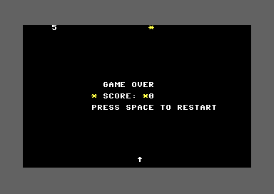

## Introduction

Skyfall runs forever - there's no way to win or lose. Real games have endings.

By the end of this lesson, Skyfall will be a complete game with a proper game loop!

## Game State

Games have different states:
- **Playing** - Normal gameplay
- **Game Over** - Game ended, showing results
- **Waiting** - Waiting for player to start/restart

We'll track this with a state variable:

```asm
; Add to variables
GAME_STATE = $0c               ; 0=playing, 1=game over

; State constants
STATE_PLAYING = $00
STATE_GAME_OVER = $01
```

Initialize in main:

```asm
    lda #STATE_PLAYING
    sta GAME_STATE
```

## Game Over Condition

Let's end the game after 5 misses:

```asm
; Add constant
MAX_MISSES = 5
```

Check in `update_all_objects` when an object hits bottom:

<div className="code-block">
<div className="code-block-header">Game Over Check</div>

```asm
    ; Hit bottom
    ldx $fe
    lda #$00
    sta OBJ_ACTIVE,x

    inc MISSES
    jsr display_misses
    jsr play_miss_sound

    ; Check for game over
    lda MISSES
    cmp #MAX_MISSES
    bcs trigger_game_over      ; If >= 5 misses, game over

    jmp next_object

trigger_game_over:
    lda #STATE_GAME_OVER
    sta GAME_STATE
    jsr show_game_over_screen
    jmp next_object
```
</div>

## Game Over Screen

Display a simple game over message:

<div className="code-block">
<div className="code-block-header">Game Over Display</div>

```asm
show_game_over_screen:
    ; Display "GAME OVER" centered on screen
    ; Row 10, roughly centered

    ldx #$00
write_game_over:
    lda game_over_text,x
    beq done_text              ; End at null terminator
    sta SCREEN_RAM + (10 * 40) + 14,x
    lda #WHITE
    sta COLOR_RAM + (10 * 40) + 14,x
    inx
    jmp write_game_over

done_text:
    ; Display "SCORE: XX" below
    ldx #$00
write_score_label:
    lda score_text,x
    beq done_score_label
    sta SCREEN_RAM + (12 * 40) + 14,x
    lda #WHITE
    sta COLOR_RAM + (12 * 40) + 14,x
    inx
    jmp write_score_label

done_score_label:
    ; Display actual score value
    lda SCORE
    sec
    jsr divide_by_10

    sta $fb

    txa
    clc
    adc #$30
    sta SCREEN_RAM + (12 * 40) + 21

    lda $fb
    clc
    adc #$30
    sta SCREEN_RAM + (12 * 40) + 22

    lda #WHITE
    sta COLOR_RAM + (12 * 40) + 21
    sta COLOR_RAM + (12 * 40) + 22

    ; Display "PRESS SPACE" message
    ldx #$00
write_restart:
    lda restart_text,x
    beq done_restart
    sta SCREEN_RAM + (14 * 40) + 12,x
    lda #WHITE
    sta COLOR_RAM + (14 * 40) + 12,x
    inx
    jmp write_restart

done_restart:
    rts

; Text data
game_over_text:
    !text "GAME OVER"
    !byte $00

score_text:
    !text "SCORE: "
    !byte $00

restart_text:
    !text "PRESS SPACE TO RESTART"
    !byte $00
```
</div>

## Modifying Game Loop

Only update the game when in PLAYING state:

<div className="code-block">
<div className="code-block-header">State-Based Game Loop</div>

```asm
game_loop:
    jsr wait_for_raster

    ; Check game state
    lda GAME_STATE
    cmp #STATE_GAME_OVER
    beq game_over_loop         ; Jump to game over handling

    ; Normal gameplay updates
    lda SOUND_TIMER
    beq no_sound_playing
    dec SOUND_TIMER
    bne no_sound_playing
    jsr stop_sound
no_sound_playing:

    dec MOVE_COUNTER
    bne skip_player_movement
    lda #3
    sta MOVE_COUNTER
    jsr check_keys
skip_player_movement:

    dec FALL_COUNTER
    bne skip_object_fall
    lda #5
    sta FALL_COUNTER
    jsr update_all_objects
    jsr check_all_collisions
    jsr draw_player           ; Redraw player (in case object erased it)
skip_object_fall:

    dec SPAWN_COUNTER
    bne skip_spawn
    lda #SPAWN_DELAY
    sta SPAWN_COUNTER
    jsr spawn_object
skip_spawn:

    jmp game_loop

game_over_loop:
    jsr wait_for_raster
    jsr check_restart_key
    jmp game_over_loop
```
</div>

## Restart Functionality

Check for spacebar press:

<div className="code-block">
<div className="code-block-header">Restart Handler</div>

```asm
check_restart_key:
    ; Check spacebar
    lda #%01111111             ; Column for space
    sta CIA1_PORT_B
    lda CIA1_PORT_A
    and #%00010000             ; Bit 4 for space
    beq restart_game           ; Space pressed
    rts

restart_game:
    ; Reset all game variables
    lda #$00
    sta SCORE
    sta MISSES

    lda #3
    sta MOVE_COUNTER

    lda #5
    sta FALL_COUNTER

    lda #SPAWN_DELAY
    sta SPAWN_COUNTER

    lda #PLAYER_START_COL
    sta PLAYER_COL

    ; Clear all objects
    ldx #$00
clear_objects_restart:
    lda #$00
    sta OBJ_ACTIVE,x
    inx
    cpx #MAX_OBJECTS
    bne clear_objects_restart

    ; Clear and redraw screen
    jsr clear_screen
    jsr draw_player
    jsr spawn_object
    jsr display_score
    jsr display_misses

    ; Return to playing state
    lda #STATE_PLAYING
    sta GAME_STATE

    rts
```
</div>

## Complete Lesson 15 Code

<div className="code-block">
<div className="code-block-header">skyfall.asm - Complete</div>

```asm
; SKYFALL - Lesson 15
; Game over and restart

* = $0801

; BASIC stub: SYS 2061
!byte $0c,$08,$0a,$00,$9e
!byte $32,$30,$36,$31          ; "2061" in ASCII
!byte $00,$00,$00

* = $080d

; ===================================
; Constants
; ===================================
SCREEN_RAM = $0400
COLOR_RAM = $d800
VIC_BORDER = $d020
VIC_BACKGROUND = $d021
CIA1_PORT_A = $dc01
CIA1_PORT_B = $dc00
VIC_RASTER = $d012

SID_V1_FREQ_LO = $d400
SID_V1_FREQ_HI = $d401
SID_V1_CONTROL = $d404
SID_V1_AD = $d405
SID_V1_SR = $d406
SID_V3_FREQ_LO = $d40e
SID_V3_FREQ_HI = $d40f
SID_V3_CONTROL = $d412
SID_V3_OSC = $d41b
SID_VOLUME = $d418

BLACK = $00
WHITE = $01
YELLOW = $07
DARK_GREY = $0b

PLAYER_CHAR = $1e
PLAYER_COLOR = WHITE
PLAYER_ROW = 23
PLAYER_START_COL = 20

OBJECT_CHAR = $2a
OBJECT_COLOR = YELLOW

MAX_OBJECTS = 3
SPAWN_DELAY = 60
MAX_MISSES = 5

STATE_PLAYING = $00
STATE_GAME_OVER = $01

; Variables
PLAYER_COL = $02
MOVE_COUNTER = $03
FALL_COUNTER = $07
SCORE = $08
MISSES = $09
SPAWN_COUNTER = $0a
SOUND_TIMER = $0b
GAME_STATE = $0c

; Object arrays
OBJ_COL = $10                  ; 3 bytes
OBJ_ROW = $13                  ; 3 bytes
OBJ_ACTIVE = $16               ; 3 bytes

; ===================================
; Main Program
; ===================================
main:
    jsr init_screen
    jsr init_random
    jsr init_sound

    lda #PLAYER_START_COL
    sta PLAYER_COL

    lda #3
    sta MOVE_COUNTER

    lda #5
    sta FALL_COUNTER

    lda #SPAWN_DELAY
    sta SPAWN_COUNTER

    lda #$00
    sta SCORE
    sta MISSES
    sta SOUND_TIMER

    lda #STATE_PLAYING
    sta GAME_STATE

    ; Clear all objects
    ldx #$00
clear_objects:
    lda #$00
    sta OBJ_ACTIVE,x
    inx
    cpx #MAX_OBJECTS
    bne clear_objects

    jsr draw_player
    jsr spawn_object
    jsr display_score
    jsr display_misses

game_loop:
    jsr wait_for_raster

    ; Check game state
    lda GAME_STATE
    cmp #STATE_GAME_OVER
    beq game_over_loop

    ; Normal gameplay
    lda SOUND_TIMER
    beq no_sound_playing
    dec SOUND_TIMER
    bne no_sound_playing
    jsr stop_sound
no_sound_playing:

    dec MOVE_COUNTER
    bne skip_player_movement
    lda #3
    sta MOVE_COUNTER
    jsr check_keys
skip_player_movement:

    dec FALL_COUNTER
    bne skip_object_fall
    lda #5
    sta FALL_COUNTER
    jsr update_all_objects
    jsr check_all_collisions
    jsr draw_player           ; Redraw player (in case object erased it)
skip_object_fall:

    dec SPAWN_COUNTER
    bne skip_spawn
    lda #SPAWN_DELAY
    sta SPAWN_COUNTER
    jsr spawn_object
skip_spawn:

    jmp game_loop

game_over_loop:
    jsr wait_for_raster
    jsr check_restart_key
    jmp game_over_loop

; ===================================
; Subroutines
; ===================================

wait_for_raster:
    lda VIC_RASTER
    cmp #250
    bne wait_for_raster
    rts

init_screen:
    jsr wait_for_raster
    lda #BLACK
    sta VIC_BACKGROUND
    lda #DARK_GREY
    sta VIC_BORDER
    jsr clear_screen
    rts

init_random:
    lda #$ff
    sta SID_V3_FREQ_LO
    sta SID_V3_FREQ_HI
    lda #$80
    sta SID_V3_CONTROL
    rts

init_sound:
    lda #$0f
    sta SID_VOLUME
    rts

play_catch_sound:
    lda #$3e
    sta SID_V1_FREQ_LO
    lda #$11
    sta SID_V1_FREQ_HI
    lda #$09
    sta SID_V1_AD
    lda #$00
    sta SID_V1_SR
    lda #$11
    sta SID_V1_CONTROL
    lda #10
    sta SOUND_TIMER
    rts

play_miss_sound:
    lda #$f7
    sta SID_V1_FREQ_LO
    lda #$04
    sta SID_V1_FREQ_HI
    lda #$00
    sta SID_V1_AD
    lda #$a8
    sta SID_V1_SR
    lda #$21
    sta SID_V1_CONTROL
    lda #20
    sta SOUND_TIMER
    rts

stop_sound:
    lda SID_V1_CONTROL
    and #$fe
    sta SID_V1_CONTROL
    rts

divide_by_10:
    ldx #$00
divide_loop:
    cmp #10
    bcc done_divide
    sbc #10
    inx
    jmp divide_loop
done_divide:
    rts

get_random:
    lda SID_V3_OSC
    rts

get_random_column:
try_again:
    jsr get_random
    and #%00111111
    cmp #40
    bcs try_again
    rts

clear_screen:
    lda #$20
    ldx #$00
clear_screen_loop:
    sta SCREEN_RAM,x
    sta SCREEN_RAM + $100,x
    sta SCREEN_RAM + $200,x
    sta SCREEN_RAM + $300,x
    inx
    bne clear_screen_loop

    lda #WHITE
    ldx #$00
clear_color_loop:
    sta COLOR_RAM,x
    sta COLOR_RAM + $100,x
    sta COLOR_RAM + $200,x
    sta COLOR_RAM + $300,x
    inx
    bne clear_color_loop
    rts

check_keys:
    ; Check D key (column 2, row 2)
    lda #%11111011
    sta CIA1_PORT_B
    lda CIA1_PORT_A
    and #%00000100
    beq move_right

    ; Check A key (column 1, row 2)
    lda #%11111101
    sta CIA1_PORT_B
    lda CIA1_PORT_A
    and #%00000100
    beq move_left

    rts

move_left:
    lda PLAYER_COL
    beq skip_left
    jsr erase_player
    dec PLAYER_COL
    jsr draw_player
skip_left:
    rts

move_right:
    lda PLAYER_COL
    cmp #39
    beq skip_right
    jsr erase_player
    inc PLAYER_COL
    jsr draw_player
skip_right:
    rts

erase_player:
    ldx PLAYER_COL
    lda #$20
    sta SCREEN_RAM + (PLAYER_ROW * 40),x
    rts

draw_player:
    ldx PLAYER_COL
    lda #PLAYER_CHAR
    sta SCREEN_RAM + (PLAYER_ROW * 40),x
    lda #PLAYER_COLOR
    sta COLOR_RAM + (PLAYER_ROW * 40),x
    rts

spawn_object:
    ldx #$00
find_slot:
    lda OBJ_ACTIVE,x
    beq found_slot
    inx
    cpx #MAX_OBJECTS
    bne find_slot
    rts
found_slot:
    lda #$01
    sta OBJ_ACTIVE,x
    lda #$00
    sta OBJ_ROW,x
    stx $fd
    jsr get_random_column
    ldx $fd
    sta OBJ_COL,x
    jsr draw_object
    rts

update_all_objects:
    ldx #$00
update_loop:
    stx $fe
    lda OBJ_ACTIVE,x
    beq skip_this_object
    jsr erase_object
    ldx $fe
    inc OBJ_ROW,x
    lda OBJ_ROW,x
    cmp #24
    bne still_falling_check

    ; Hit bottom
    ldx $fe
    lda #$00
    sta OBJ_ACTIVE,x

    inc MISSES
    jsr display_misses
    jsr play_miss_sound

    ; Check for game over
    lda MISSES
    cmp #MAX_MISSES
    bcs trigger_game_over

    jsr spawn_object
    jmp next_object

trigger_game_over:
    lda #STATE_GAME_OVER
    sta GAME_STATE
    jsr show_game_over_screen
    jmp next_object

still_falling_check:
    ldx $fe
    jsr draw_object
skip_this_object:
next_object:
    ldx $fe
    inx
    cpx #MAX_OBJECTS
    bne update_loop
    rts

check_all_collisions:
    ldx #$00
collision_loop:
    stx $fe
    lda OBJ_ACTIVE,x
    beq skip_collision
    lda OBJ_ROW,x
    cmp #PLAYER_ROW
    bne skip_collision
    ldx $fe
    lda OBJ_COL,x
    cmp PLAYER_COL
    bne skip_collision
    ldx $fe
    jsr handle_catch
skip_collision:
    ldx $fe
    inx
    cpx #MAX_OBJECTS
    bne collision_loop
    rts

check_collision:
    lda OBJ_ROW,x
    cmp #PLAYER_ROW
    bne no_collision

    lda OBJ_COL,x
    cmp PLAYER_COL
    bne no_collision

    jsr handle_catch

no_collision:
    rts

handle_catch:
    jsr erase_object
    lda #$00
    sta OBJ_ACTIVE,x
    inc SCORE
    jsr display_score
    jsr play_catch_sound
    jsr spawn_object
    rts

; Row offset lookup table (low bytes)
row_offset_lo:
    !byte <(0*40), <(1*40), <(2*40), <(3*40), <(4*40)
    !byte <(5*40), <(6*40), <(7*40), <(8*40), <(9*40)
    !byte <(10*40), <(11*40), <(12*40), <(13*40), <(14*40)
    !byte <(15*40), <(16*40), <(17*40), <(18*40), <(19*40)
    !byte <(20*40), <(21*40), <(22*40), <(23*40), <(24*40)

; Row offset lookup table (high bytes)
row_offset_hi:
    !byte >(0*40), >(1*40), >(2*40), >(3*40), >(4*40)
    !byte >(5*40), >(6*40), >(7*40), >(8*40), >(9*40)
    !byte >(10*40), >(11*40), >(12*40), >(13*40), >(14*40)
    !byte >(15*40), >(16*40), >(17*40), >(18*40), >(19*40)
    !byte >(20*40), >(21*40), >(22*40), >(23*40), >(24*40)

draw_object:
    ; Save current X
    stx $fd

    ; Get row offset from table
    ldy OBJ_ROW,x
    lda row_offset_lo,y
    sta $fb
    lda row_offset_hi,y
    sta $fc

    ; Add column
    ldx $fd
    lda $fb
    clc
    adc OBJ_COL,x
    sta $fb
    bcc +
    inc $fc
+
    ; Add SCREEN_RAM base
    lda $fb
    clc
    adc #<SCREEN_RAM
    sta $fb
    lda $fc
    adc #>SCREEN_RAM
    sta $fc

    ; Draw character
    ldy #0
    lda #OBJECT_CHAR
    sta ($fb),y

    ; Calculate COLOR_RAM address
    lda $fb
    clc
    adc #<(COLOR_RAM-SCREEN_RAM)
    sta $fb
    lda $fc
    adc #>(COLOR_RAM-SCREEN_RAM)
    sta $fc

    ; Draw color
    lda #OBJECT_COLOR
    sta ($fb),y

    ldx $fd
    rts

erase_object:
    ; Save current X
    stx $fd

    ; Get row offset from table
    ldy OBJ_ROW,x
    lda row_offset_lo,y
    sta $fb
    lda row_offset_hi,y
    sta $fc

    ; Add column
    ldx $fd
    lda $fb
    clc
    adc OBJ_COL,x
    sta $fb
    bcc +
    inc $fc
+
    ; Add SCREEN_RAM base
    lda $fb
    clc
    adc #<SCREEN_RAM
    sta $fb
    lda $fc
    adc #>SCREEN_RAM
    sta $fc

    ; Erase with space
    ldy #0
    lda #$20
    sta ($fb),y

    ldx $fd
    rts

display_score:
    lda #$20
    sta SCREEN_RAM
    sta SCREEN_RAM + 1

    lda SCORE
    sec
    jsr divide_by_10

    sta $fb

    txa
    beq skip_tens

    clc
    adc #$30
    sta SCREEN_RAM

    lda $fb
    clc
    adc #$30
    sta SCREEN_RAM + 1

    lda #WHITE
    sta COLOR_RAM
    sta COLOR_RAM + 1
    rts

skip_tens:
    lda $fb
    clc
    adc #$30
    sta SCREEN_RAM
    lda #WHITE
    sta COLOR_RAM
    rts

display_misses:
    lda #$20
    sta SCREEN_RAM + 5
    sta SCREEN_RAM + 6

    lda MISSES
    sec
    jsr divide_by_10

    sta $fb

    txa
    beq skip_miss_tens

    clc
    adc #$30
    sta SCREEN_RAM + 5

    lda $fb
    clc
    adc #$30
    sta SCREEN_RAM + 6

    lda #WHITE
    sta COLOR_RAM + 5
    sta COLOR_RAM + 6
    rts

skip_miss_tens:
    lda $fb
    clc
    adc #$30
    sta SCREEN_RAM + 5
    lda #WHITE
    sta COLOR_RAM + 5
    rts

show_game_over_screen:
    ; Stop any playing sound first
    jsr stop_sound
    lda #$00
    sta SOUND_TIMER

    ; Display "GAME OVER" - 9 chars, centered at column 15
    ldx #$00
write_game_over:
    lda game_over_text,x
    beq done_text
    sta SCREEN_RAM + (10 * 40) + 15,x
    lda #WHITE
    sta COLOR_RAM + (10 * 40) + 15,x
    inx
    jmp write_game_over

done_text:
    ; Display "SCORE: " - 7 chars, starting at column 15
    ldx #$00
write_score_label:
    lda score_text,x
    beq done_score_label
    sta SCREEN_RAM + (12 * 40) + 15,x
    lda #WHITE
    sta COLOR_RAM + (12 * 40) + 15,x
    inx
    jmp write_score_label

done_score_label:
    ; Display score value (2 digits after "SCORE: ")
    lda SCORE
    sec
    jsr divide_by_10

    sta $fb

    txa
    clc
    adc #$30
    sta SCREEN_RAM + (12 * 40) + 22

    lda $fb
    clc
    adc #$30
    sta SCREEN_RAM + (12 * 40) + 23

    lda #WHITE
    sta COLOR_RAM + (12 * 40) + 22
    sta COLOR_RAM + (12 * 40) + 23

    ; Display "PRESS SPACE TO RESTART" - 22 chars, centered at column 9
    ldx #$00
write_restart:
    lda restart_text,x
    beq done_restart
    sta SCREEN_RAM + (14 * 40) + 9,x
    lda #WHITE
    sta COLOR_RAM + (14 * 40) + 9,x
    inx
    jmp write_restart

done_restart:
    rts

check_restart_key:
    lda #%01111111
    sta CIA1_PORT_B
    lda CIA1_PORT_A
    and #%00010000
    beq restart_game
    rts

restart_game:
    lda #$00
    sta SCORE
    sta MISSES

    lda #3
    sta MOVE_COUNTER

    lda #5
    sta FALL_COUNTER

    lda #SPAWN_DELAY
    sta SPAWN_COUNTER

    lda #PLAYER_START_COL
    sta PLAYER_COL

    ldx #$00
clear_objects_restart:
    lda #$00
    sta OBJ_ACTIVE,x
    inx
    cpx #MAX_OBJECTS
    bne clear_objects_restart

    jsr clear_screen
    jsr draw_player
    jsr spawn_object
    jsr display_score
    jsr display_misses

    lda #STATE_PLAYING
    sta GAME_STATE

    jmp game_loop

; Text data (screen codes for uppercase)
game_over_text:
    !byte $07,$01,$0d,$05,$20,$0f,$16,$05,$12,$00  ; "GAME OVER" + null

score_text:
    !byte $13,$03,$0f,$12,$05,$3a,$20,$00          ; "SCORE: " + null

restart_text:
    !byte $10,$12,$05,$13,$13,$20,$13,$10,$01,$03,$05,$20,$14,$0f,$20,$12,$05,$13,$14,$01,$12,$14,$00  ; "PRESS SPACE TO RESTART" + null
```
</div>

Build and run. Miss 5 objects and you'll see the game over screen. Press space to restart and play again!



## New Concepts

### State Machine Pattern

Games use state machines to manage different modes:

```
PLAYING → (5 misses) → GAME OVER
GAME OVER → (press space) → PLAYING
```

Each state has different behavior:
- **PLAYING**: Update objects, check collisions, spawn new objects
- **GAME OVER**: Only check for restart key

This pattern scales to complex games with menus, pause screens, cutscenes, etc.

### String Data in Assembly

We store text as byte arrays:

```asm
game_over_text:
    !text "GAME OVER"
    !byte $00              ; Null terminator
```

The `!text` directive converts ASCII to PETSCII. The $00 marks the end.

### Text Rendering Loop

The pattern for displaying strings:

```asm
ldx #$00                   ; Index = 0
loop:
    lda text_data,x        ; Load character
    beq done               ; If $00, done
    sta SCREEN_RAM,x       ; Display it
    inx                    ; Next character
    jmp loop
done:
```

This works for any null-terminated string.

### Reset vs. Restart

- **Reset** = reload the entire program (what RUN/STOP + RESTORE does)
- **Restart** = reset game variables and continue running

Our restart is faster and smoother - it just resets variables and clears the screen.

### Conditional Branching to Labels

The game loop branches based on state:

```asm
cmp #STATE_GAME_OVER
beq game_over_loop         ; Jump to different loop
; ... normal code
```

This creates two separate loops that the game switches between.

<div className="exercise">
<div className="exercise-title">🎯 Your Tasks</div>

1. **Build and run** - Play until game over, then restart
2. **Change max misses** - Try 3 or 10 instead of 5
3. **Add a win condition** - End game at score 50 with "YOU WIN!" message
4. **Improve the screen** - Add a border around the game over text
5. **Add difficulty** - Make objects fall faster as score increases

</div>

## Congratulations!

You've built a complete game from scratch in 6502 assembly!

Skyfall has everything:
- ✓ Player controls
- ✓ Multiple moving objects
- ✓ Collision detection
- ✓ Score tracking
- ✓ Sound effects
- ✓ Game over and restart

You've learned:
- Screen memory manipulation
- Keyboard input
- Timing and game loops
- Random number generation
- Arrays and object management
- SID chip programming
- Number display
- State machines

This is the foundation for ANY C64 game. From here, you could add:
- Sprites for better graphics
- Music
- Power-ups
- Different object types
- Levels and progression
- High score saving

But you have all the core skills. You're a C64 game programmer now!