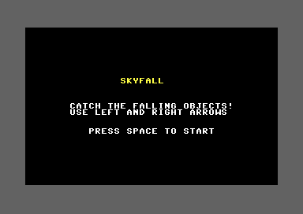
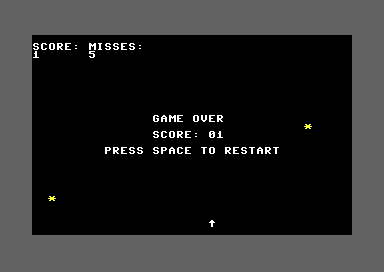

## Introduction

Skyfall works, but it doesn't feel finished. Professional games have polish - small details that make everything feel cohesive.

By the end of this final lesson, Skyfall will feel like a real arcade game!

## Title Screen

Let's add a title screen before gameplay starts. Add a new state:

```asm
; Add to state constants
STATE_TITLE = $02

; Initialize to title screen instead of playing
main:
    ; ... setup code ...

    lda #STATE_TITLE           ; Start at title screen
    sta GAME_STATE

    jsr show_title_screen      ; Show it immediately
```

Create the title screen:

<div className="code-block">
<div className="code-block-header">Title Screen Display</div>

```asm
show_title_screen:
    jsr clear_screen

    ; Display "SKYFALL" title
    ldx #$00
write_title:
    lda title_text,x
    beq done_title
    sta SCREEN_RAM + (8 * 40) + 15,x
    lda #YELLOW                ; Yellow title
    sta COLOR_RAM + (8 * 40) + 15,x
    inx
    jmp write_title

done_title:
    ; Display instructions
    ldx #$00
write_instructions1:
    lda instructions1_text,x
    beq done_inst1
    sta SCREEN_RAM + (12 * 40) + 7,x
    lda #WHITE
    sta COLOR_RAM + (12 * 40) + 7,x
    inx
    jmp write_instructions1

done_inst1:
    ldx #$00
write_instructions2:
    lda instructions2_text,x
    beq done_inst2
    sta SCREEN_RAM + (13 * 40) + 10,x
    lda #WHITE
    sta COLOR_RAM + (13 * 40) + 10,x
    inx
    jmp write_instructions2

done_inst2:
    ; Display "PRESS SPACE TO START"
    ldx #$00
write_start:
    lda start_text,x
    beq done_start
    sta SCREEN_RAM + (16 * 40) + 9,x
    lda #WHITE
    sta COLOR_RAM + (16 * 40) + 9,x
    inx
    jmp write_start

done_start:
    rts

; Text data
title_text:
    !text "S K Y F A L L"
    !byte $00

instructions1_text:
    !text "CATCH FALLING OBJECTS"
    !byte $00

instructions2_text:
    !text "USE A AND D TO MOVE"
    !byte $00

start_text:
    !text "PRESS SPACE TO START"
    !byte $00
```
</div>

Update game loop to handle title state:

```asm
game_loop:
    jsr wait_for_raster

    ; Check game state
    lda GAME_STATE
    cmp #STATE_GAME_OVER
    beq game_over_loop

    cmp #STATE_TITLE
    beq title_loop

    ; Normal gameplay...
    ; (rest of game loop)

title_loop:
    jsr wait_for_raster
    jsr check_start_key
    jmp title_loop

check_start_key:
    lda #%01111111
    sta CIA1_PORT_B
    lda CIA1_PORT_A
    and #%00010000
    beq start_game
    rts

start_game:
    ; Same as restart_game but from title
    lda #$00
    sta SCORE
    sta MISSES

    lda #3
    sta MOVE_COUNTER

    lda #5
    sta FALL_COUNTER

    lda #SPAWN_DELAY
    sta SPAWN_COUNTER

    lda #PLAYER_START_COL
    sta PLAYER_COL

    ldx #$00
clear_objects_start:
    lda #$00
    sta OBJ_ACTIVE,x
    inx
    cpx #MAX_OBJECTS
    bne clear_objects_start

    jsr clear_screen
    jsr draw_ui_labels         ; Add this!
    jsr draw_player
    jsr spawn_object
    jsr display_score
    jsr display_misses

    lda #STATE_PLAYING
    sta GAME_STATE

    rts
```

{/* TODO: Add screenshot when available

*/}

## UI Labels

Add permanent labels for score and misses:

<div className="code-block">
<div className="code-block-header">UI Labels</div>

```asm
draw_ui_labels:
    ; "SCORE:" label at top left
    ldx #$00
write_score_label_ui:
    lda score_label_text,x
    beq done_score_ui_label
    sta SCREEN_RAM + 40,x      ; Row 1
    lda #WHITE
    sta COLOR_RAM + 40,x
    inx
    jmp write_score_label_ui

done_score_ui_label:
    ; "MISSES:" label next to it
    ldx #$00
write_misses_label_ui:
    lda misses_label_text,x
    beq done_misses_ui_label
    sta SCREEN_RAM + 47,x      ; Row 1, offset
    lda #WHITE
    sta COLOR_RAM + 47,x
    inx
    jmp write_misses_label_ui

done_misses_ui_label:
    rts

score_label_text:
    !text "SCORE:"
    !byte $00

misses_label_text:
    !text "MISSES:"
    !byte $00
```
</div>

Update score/misses display positions to be below labels:

```asm
display_score:
    ; Clear score area (now on row 2, under label)
    lda #$20
    sta SCREEN_RAM + 80        ; Row 2, position 0
    sta SCREEN_RAM + 81

    lda SCORE
    sec
    jsr divide_by_10

    sta $fb

    txa
    beq skip_tens

    clc
    adc #$30
    sta SCREEN_RAM + 80

    lda $fb
    clc
    adc #$30
    sta SCREEN_RAM + 81

    lda #WHITE
    sta COLOR_RAM + 80
    sta COLOR_RAM + 81
    rts

skip_tens:
    lda $fb
    clc
    adc #$30
    sta SCREEN_RAM + 80
    lda #WHITE
    sta COLOR_RAM + 80
    rts

display_misses:
    ; Clear misses area (row 2, offset)
    lda #$20
    sta SCREEN_RAM + 87
    sta SCREEN_RAM + 88

    lda MISSES
    sec
    jsr divide_by_10

    sta $fb

    txa
    beq skip_miss_tens

    clc
    adc #$30
    sta SCREEN_RAM + 87

    lda $fb
    clc
    adc #$30
    sta SCREEN_RAM + 88

    lda #WHITE
    sta COLOR_RAM + 87
    sta COLOR_RAM + 88
    rts

skip_miss_tens:
    lda $fb
    clc
    adc #$30
    sta SCREEN_RAM + 87
    lda #WHITE
    sta COLOR_RAM + 87
    rts
```

{/* TODO: Add screenshot when available

*/}

## Progressive Difficulty

Make the game harder as the score increases:

<div className="code-block">
<div className="code-block-header">Dynamic Difficulty</div>

```asm
; Add variable for fall speed
FALL_SPEED = $0d               ; Base fall speed

; Initialize in main
    lda #5
    sta FALL_SPEED

adjust_difficulty:
    ; Increase fall speed every 5 points
    lda SCORE
    cmp #5
    bcc no_speed_change

    cmp #10
    bcc set_speed_4

    cmp #20
    bcc set_speed_3

    cmp #30
    bcc set_speed_2

    ; Maximum speed
    lda #1
    sta FALL_SPEED
    rts

set_speed_4:
    lda #4
    sta FALL_SPEED
    rts

set_speed_3:
    lda #3
    sta FALL_SPEED
    rts

set_speed_2:
    lda #2
    sta FALL_SPEED
    rts

no_speed_change:
    rts
```
</div>

Use the variable in game loop:

```asm
    ; Object falling (now uses dynamic speed)
    dec FALL_COUNTER
    bne skip_object_fall
    lda FALL_SPEED             ; Use current speed!
    sta FALL_COUNTER
    jsr update_all_objects
skip_object_fall:
```

Call after catching:

```asm
handle_catch:
    jsr erase_object

    lda #$00
    sta OBJ_ACTIVE,x

    inc SCORE
    jsr display_score
    jsr play_catch_sound

    jsr adjust_difficulty      ; Add this!

    jsr spawn_object
    rts
```

## Visual Flourish: Catch Feedback

Make caught objects briefly flash before disappearing:

<div className="code-block">
<div className="code-block-header">Flash Effect</div>

```asm
; Add variables for flash effect
FLASH_TIMER = $0e
FLASH_OBJ = $0f

handle_catch:
    ; Don't erase immediately - flash first
    ldx $fe

    ; Save object index for flash
    stx FLASH_OBJ

    ; Set flash timer
    lda #6                     ; Flash for 6 frames
    sta FLASH_TIMER

    lda #$00
    sta OBJ_ACTIVE,x

    inc SCORE
    jsr display_score
    jsr play_catch_sound
    jsr adjust_difficulty

    jsr spawn_object
    rts
```
</div>

Update game loop to handle flash:

```asm
game_loop:
    jsr wait_for_raster

    ; Handle flash effect
    lda FLASH_TIMER
    beq no_flash
    dec FLASH_TIMER
    bne flash_continue

    ; Flash done, erase
    ldx FLASH_OBJ
    jsr erase_object
    jmp no_flash

flash_continue:
    ; Flash by changing color
    ldx FLASH_OBJ
    lda OBJ_ROW,x
    jsr calc_row_times_40
    clc
    adc OBJ_COL,x
    tay

    lda FLASH_TIMER
    and #$01                   ; Alternate colors
    beq flash_white
    lda #YELLOW
    jmp do_flash
flash_white:
    lda #WHITE
do_flash:
    sta COLOR_RAM,y

no_flash:
    ; Check game state
    ; (rest of game loop...)
```

## Polish: Improved Game Over Screen

Add a border to the game over screen:

<div className="code-block">
<div className="code-block-header">Bordered Game Over</div>

```asm
show_game_over_screen:
    ; Draw a simple box around the text
    ; Top border (row 8)
    ldx #$00
draw_top_border:
    lda #$40                   ; PETSCII horizontal line
    sta SCREEN_RAM + (8 * 40) + 10,x
    lda #DARK_GREY
    sta COLOR_RAM + (8 * 40) + 10,x
    inx
    cpx #20
    bne draw_top_border

    ; Bottom border (row 16)
    ldx #$00
draw_bottom_border:
    lda #$40
    sta SCREEN_RAM + (16 * 40) + 10,x
    lda #DARK_GREY
    sta COLOR_RAM + (16 * 40) + 10,x
    inx
    cpx #20
    bne draw_bottom_border

    ; Now display the text (centered within border)
    ldx #$00
write_game_over:
    lda game_over_text,x
    beq done_text
    sta SCREEN_RAM + (10 * 40) + 14,x
    lda #YELLOW                ; Yellow for emphasis
    sta COLOR_RAM + (10 * 40) + 14,x
    inx
    jmp write_game_over

done_text:
    ; (rest of game over screen code...)
```
</div>

## Final Code Organization

Add a header comment:

```asm
; ===================================
; SKYFALL
; A Complete C64 Game
;
; Created through the Code Like It's 198x
; Assembly Programming Course
;
; Controls: A/D to move left/right
; Goal: Catch falling objects
; Lose: Miss 5 objects
; ===================================

* = $0801
```

## Complete Lesson 16 Code

<div className="code-block">
<div className="code-block-header">skyfall.asm - Complete</div>

```asm
; SKYFALL - Lesson 16
; Complete game with title screen, UI, difficulty, and polish

* = $0801

; BASIC stub: SYS 2061
!byte $0c,$08,$0a,$00,$9e
!byte $32,$30,$36,$31          ; "2061" in ASCII
!byte $00,$00,$00

* = $080d

; ===================================
; Constants
; ===================================
SCREEN_RAM = $0400
COLOR_RAM = $d800
VIC_BORDER = $d020
VIC_BACKGROUND = $d021
CIA1_PORT_A = $dc01
CIA1_PORT_B = $dc00
VIC_RASTER = $d012

SID_V1_FREQ_LO = $d400
SID_V1_FREQ_HI = $d401
SID_V1_CONTROL = $d404
SID_V1_AD = $d405
SID_V1_SR = $d406
SID_V3_FREQ_LO = $d40e
SID_V3_FREQ_HI = $d40f
SID_V3_CONTROL = $d412
SID_V3_OSC = $d41b
SID_VOLUME = $d418

BLACK = $00
WHITE = $01
YELLOW = $07
DARK_GREY = $0b

PLAYER_CHAR = $1e
PLAYER_COLOR = WHITE
PLAYER_ROW = 23
PLAYER_START_COL = 20

OBJECT_CHAR = $2a
OBJECT_COLOR = YELLOW

MAX_OBJECTS = 3
SPAWN_DELAY = 60
MAX_MISSES = 5

STATE_PLAYING = $00
STATE_GAME_OVER = $01
STATE_TITLE = $02

; Variables
PLAYER_COL = $02
MOVE_COUNTER = $03
FALL_COUNTER = $07
SCORE = $08
MISSES = $09
SPAWN_COUNTER = $0a
SOUND_TIMER = $0b
GAME_STATE = $0c
FALL_SPEED = $0d
FLASH_TIMER = $0e
FLASH_OBJ = $0f

; Object arrays
OBJ_COL = $10                  ; 3 bytes
OBJ_ROW = $13                  ; 3 bytes
OBJ_ACTIVE = $16               ; 3 bytes

; ===================================
; Main Program
; ===================================
main:
    jsr init_screen
    jsr init_random
    jsr init_sound

    lda #PLAYER_START_COL
    sta PLAYER_COL

    lda #3
    sta MOVE_COUNTER

    lda #5
    sta FALL_COUNTER

    lda #SPAWN_DELAY
    sta SPAWN_COUNTER

    lda #$00
    sta SCORE
    sta MISSES
    sta SOUND_TIMER
    sta FLASH_TIMER

    lda #5
    sta FALL_SPEED

    lda #STATE_TITLE
    sta GAME_STATE

    ; Clear all objects
    ldx #$00
clear_objects:
    lda #$00
    sta OBJ_ACTIVE,x
    inx
    cpx #MAX_OBJECTS
    bne clear_objects

    jsr show_title_screen
    jmp title_loop

game_loop:
    jsr wait_for_raster

    ; Handle flash effect
    lda FLASH_TIMER
    beq no_flash
    dec FLASH_TIMER
    bne flash_continue

    ; Flash done, erase
    ldx FLASH_OBJ
    jsr erase_object
    jmp no_flash

flash_continue:
    ; Flash by changing color
    ldx FLASH_OBJ
    lda OBJ_ROW,x
    jsr calc_row_times_40
    clc
    adc OBJ_COL,x
    tay

    lda FLASH_TIMER
    and #$01
    beq flash_white
    lda #YELLOW
    jmp do_flash
flash_white:
    lda #WHITE
do_flash:
    sta COLOR_RAM,y

no_flash:
    ; Check game state
    lda GAME_STATE
    cmp #STATE_GAME_OVER
    beq game_over_loop

    ; Normal gameplay
    lda SOUND_TIMER
    beq no_sound_playing
    dec SOUND_TIMER
    bne no_sound_playing
    jsr stop_sound
no_sound_playing:

    dec MOVE_COUNTER
    bne skip_player_movement
    lda #3
    sta MOVE_COUNTER
    jsr check_keys
skip_player_movement:

    dec FALL_COUNTER
    bne skip_object_fall
    lda FALL_SPEED
    sta FALL_COUNTER
    jsr update_all_objects
    jsr check_all_collisions
    jsr draw_player           ; Redraw player (in case object erased it)
skip_object_fall:

    dec SPAWN_COUNTER
    bne skip_spawn
    lda #SPAWN_DELAY
    sta SPAWN_COUNTER
    jsr spawn_object
skip_spawn:

    jmp game_loop

game_over_loop:
    jsr wait_for_raster
    jsr check_restart_key
    jmp game_over_loop

title_loop:
    jsr wait_for_raster
    jsr check_start_key
    jmp title_loop

check_start_key:
    lda #%01111111
    sta CIA1_PORT_B
    lda CIA1_PORT_A
    and #%00010000
    beq start_game
    rts

start_game:
    lda #$00
    sta SCORE
    sta MISSES

    lda #3
    sta MOVE_COUNTER

    lda #5
    sta FALL_COUNTER
    sta FALL_SPEED

    lda #SPAWN_DELAY
    sta SPAWN_COUNTER

    lda #PLAYER_START_COL
    sta PLAYER_COL

    ldx #$00
clear_objects_start:
    lda #$00
    sta OBJ_ACTIVE,x
    inx
    cpx #MAX_OBJECTS
    bne clear_objects_start

    jsr clear_screen
    jsr draw_ui_labels
    jsr draw_player
    jsr spawn_object
    jsr display_score
    jsr display_misses

    lda #STATE_PLAYING
    sta GAME_STATE

    jmp game_loop

; ===================================
; Subroutines
; ===================================

wait_for_raster:
    lda VIC_RASTER
    cmp #250
    bne wait_for_raster
    rts

init_screen:
    jsr wait_for_raster
    lda #BLACK
    sta VIC_BACKGROUND
    lda #DARK_GREY
    sta VIC_BORDER
    jsr clear_screen
    rts

init_random:
    lda #$ff
    sta SID_V3_FREQ_LO
    sta SID_V3_FREQ_HI
    lda #$80
    sta SID_V3_CONTROL
    rts

init_sound:
    lda #$0f
    sta SID_VOLUME
    rts

play_catch_sound:
    lda #$3e
    sta SID_V1_FREQ_LO
    lda #$11
    sta SID_V1_FREQ_HI
    lda #$09
    sta SID_V1_AD
    lda #$00
    sta SID_V1_SR
    lda #$11
    sta SID_V1_CONTROL
    lda #10
    sta SOUND_TIMER
    rts

play_miss_sound:
    lda #$f7
    sta SID_V1_FREQ_LO
    lda #$04
    sta SID_V1_FREQ_HI
    lda #$00
    sta SID_V1_AD
    lda #$a8
    sta SID_V1_SR
    lda #$21
    sta SID_V1_CONTROL
    lda #20
    sta SOUND_TIMER
    rts

stop_sound:
    lda SID_V1_CONTROL
    and #$fe
    sta SID_V1_CONTROL
    rts

adjust_difficulty:
    ; Increase fall speed based on score
    lda SCORE
    cmp #5
    bcc no_speed_change

    cmp #10
    bcc set_speed_4

    cmp #20
    bcc set_speed_3

    cmp #30
    bcc set_speed_2

    ; Maximum speed
    lda #1
    sta FALL_SPEED
    rts

set_speed_4:
    lda #4
    sta FALL_SPEED
    rts

set_speed_3:
    lda #3
    sta FALL_SPEED
    rts

set_speed_2:
    lda #2
    sta FALL_SPEED
    rts

no_speed_change:
    rts

divide_by_10:
    ldx #$00
divide_loop:
    cmp #10
    bcc done_divide
    sbc #10
    inx
    jmp divide_loop
done_divide:
    rts

; Multiply row (in A) by 40 to get screen offset
; Result in A (low byte) and X (high byte)
calc_row_times_40:
    sta $fb             ; Save row number
    lda #$00
    sta $fc             ; Clear accumulator
    ldx $fb             ; Row counter
    beq done_multiply
multiply_loop:
    clc
    adc #40             ; Add 40 for each row
    bcc no_carry
    inc $fc             ; Handle carry to high byte
no_carry:
    dex
    bne multiply_loop
done_multiply:
    ldx $fc             ; High byte in X
    rts

get_random:
    lda SID_V3_OSC
    rts

get_random_column:
try_again:
    jsr get_random
    and #%00111111
    cmp #40
    bcs try_again
    rts

clear_screen:
    lda #$20
    ldx #$00
clear_screen_loop:
    sta SCREEN_RAM,x
    sta SCREEN_RAM + $100,x
    sta SCREEN_RAM + $200,x
    sta SCREEN_RAM + $300,x
    inx
    bne clear_screen_loop

    lda #WHITE
    ldx #$00
clear_color_loop:
    sta COLOR_RAM,x
    sta COLOR_RAM + $100,x
    sta COLOR_RAM + $200,x
    sta COLOR_RAM + $300,x
    inx
    bne clear_color_loop
    rts

check_keys:
    ; Check D key (column 2, row 2)
    lda #%11111011
    sta CIA1_PORT_B
    lda CIA1_PORT_A
    and #%00000100
    beq move_right

    ; Check A key (column 1, row 2)
    lda #%11111101
    sta CIA1_PORT_B
    lda CIA1_PORT_A
    and #%00000100
    beq move_left

    rts

move_left:
    lda PLAYER_COL
    beq skip_left
    jsr erase_player
    dec PLAYER_COL
    jsr draw_player
skip_left:
    rts

move_right:
    lda PLAYER_COL
    cmp #39
    beq skip_right
    jsr erase_player
    inc PLAYER_COL
    jsr draw_player
skip_right:
    rts

erase_player:
    ldx PLAYER_COL
    lda #$20
    sta SCREEN_RAM + (PLAYER_ROW * 40),x
    rts

draw_player:
    ldx PLAYER_COL
    lda #PLAYER_CHAR
    sta SCREEN_RAM + (PLAYER_ROW * 40),x
    lda #PLAYER_COLOR
    sta COLOR_RAM + (PLAYER_ROW * 40),x
    rts

spawn_object:
    ldx #$00
find_slot:
    lda OBJ_ACTIVE,x
    beq found_slot
    inx
    cpx #MAX_OBJECTS
    bne find_slot
    rts
found_slot:
    lda #$01
    sta OBJ_ACTIVE,x
    lda #$03                ; Start at row 3 (below UI)
    sta OBJ_ROW,x
    stx $fd
    jsr get_random_column
    ldx $fd
    sta OBJ_COL,x
    jsr draw_object
    rts

update_all_objects:
    ldx #$00
update_loop:
    stx $fe
    lda OBJ_ACTIVE,x
    beq skip_this_object
    jsr erase_object
    ldx $fe
    inc OBJ_ROW,x
    lda OBJ_ROW,x
    cmp #24
    bne still_falling_check

    ; Hit bottom
    ldx $fe
    lda #$00
    sta OBJ_ACTIVE,x

    inc MISSES
    jsr display_misses
    jsr play_miss_sound

    ; Check for game over
    lda MISSES
    cmp #MAX_MISSES
    bcs trigger_game_over

    jsr spawn_object
    jmp next_object

trigger_game_over:
    lda #STATE_GAME_OVER
    sta GAME_STATE
    jsr show_game_over_screen
    jmp next_object

still_falling_check:
    ldx $fe
    jsr draw_object
skip_this_object:
next_object:
    ldx $fe
    inx
    cpx #MAX_OBJECTS
    bne update_loop
    rts

check_all_collisions:
    ldx #$00
collision_loop:
    stx $fe
    lda OBJ_ACTIVE,x
    beq skip_collision
    lda OBJ_ROW,x
    cmp #PLAYER_ROW
    bne skip_collision
    ldx $fe
    lda OBJ_COL,x
    cmp PLAYER_COL
    bne skip_collision
    ldx $fe
    jsr handle_catch
skip_collision:
    ldx $fe
    inx
    cpx #MAX_OBJECTS
    bne collision_loop
    rts

check_collision:
    lda OBJ_ROW,x
    cmp #PLAYER_ROW
    bne no_collision

    lda OBJ_COL,x
    cmp PLAYER_COL
    bne no_collision

    jsr handle_catch

no_collision:
    rts

handle_catch:
    ; Don't erase immediately - flash first
    ldx $fe

    ; Save object index for flash
    stx FLASH_OBJ

    ; Set flash timer
    lda #6
    sta FLASH_TIMER

    lda #$00
    sta OBJ_ACTIVE,x

    inc SCORE
    jsr display_score
    jsr play_catch_sound
    jsr adjust_difficulty

    jsr spawn_object
    rts

; Row offset lookup table (low bytes)
row_offset_lo:
    !byte <(0*40), <(1*40), <(2*40), <(3*40), <(4*40)
    !byte <(5*40), <(6*40), <(7*40), <(8*40), <(9*40)
    !byte <(10*40), <(11*40), <(12*40), <(13*40), <(14*40)
    !byte <(15*40), <(16*40), <(17*40), <(18*40), <(19*40)
    !byte <(20*40), <(21*40), <(22*40), <(23*40), <(24*40)

; Row offset lookup table (high bytes)
row_offset_hi:
    !byte >(0*40), >(1*40), >(2*40), >(3*40), >(4*40)
    !byte >(5*40), >(6*40), >(7*40), >(8*40), >(9*40)
    !byte >(10*40), >(11*40), >(12*40), >(13*40), >(14*40)
    !byte >(15*40), >(16*40), >(17*40), >(18*40), >(19*40)
    !byte >(20*40), >(21*40), >(22*40), >(23*40), >(24*40)

draw_object:
    ; Save current X
    stx $fd

    ; Get row offset from table
    ldy OBJ_ROW,x
    lda row_offset_lo,y
    sta $fb
    lda row_offset_hi,y
    sta $fc

    ; Add column
    ldx $fd
    lda $fb
    clc
    adc OBJ_COL,x
    sta $fb
    bcc +
    inc $fc
+
    ; Add SCREEN_RAM base
    lda $fb
    clc
    adc #<SCREEN_RAM
    sta $fb
    lda $fc
    adc #>SCREEN_RAM
    sta $fc

    ; Draw character
    ldy #0
    lda #OBJECT_CHAR
    sta ($fb),y

    ; Calculate COLOR_RAM address
    lda $fb
    clc
    adc #<(COLOR_RAM-SCREEN_RAM)
    sta $fb
    lda $fc
    adc #>(COLOR_RAM-SCREEN_RAM)
    sta $fc

    ; Draw color
    lda #OBJECT_COLOR
    sta ($fb),y

    ldx $fd
    rts

erase_object:
    ; Save current X
    stx $fd

    ; Get row offset from table
    ldy OBJ_ROW,x
    lda row_offset_lo,y
    sta $fb
    lda row_offset_hi,y
    sta $fc

    ; Add column
    ldx $fd
    lda $fb
    clc
    adc OBJ_COL,x
    sta $fb
    bcc +
    inc $fc
+
    ; Add SCREEN_RAM base
    lda $fb
    clc
    adc #<SCREEN_RAM
    sta $fb
    lda $fc
    adc #>SCREEN_RAM
    sta $fc

    ; Erase with space
    ldy #0
    lda #$20
    sta ($fb),y

    ldx $fd
    rts

display_score:
    lda #$20
    sta SCREEN_RAM + 80
    sta SCREEN_RAM + 81

    lda SCORE
    sec
    jsr divide_by_10

    sta $fb

    txa
    beq skip_tens

    clc
    adc #$30
    sta SCREEN_RAM + 80

    lda $fb
    clc
    adc #$30
    sta SCREEN_RAM + 81

    lda #WHITE
    sta COLOR_RAM + 80
    sta COLOR_RAM + 81
    rts

skip_tens:
    lda $fb
    clc
    adc #$30
    sta SCREEN_RAM + 80
    lda #WHITE
    sta COLOR_RAM + 80
    rts

display_misses:
    lda #$20
    sta SCREEN_RAM + 87
    sta SCREEN_RAM + 88

    lda MISSES
    sec
    jsr divide_by_10

    sta $fb

    txa
    beq skip_miss_tens

    clc
    adc #$30
    sta SCREEN_RAM + 87

    lda $fb
    clc
    adc #$30
    sta SCREEN_RAM + 88

    lda #WHITE
    sta COLOR_RAM + 87
    sta COLOR_RAM + 88
    rts

skip_miss_tens:
    lda $fb
    clc
    adc #$30
    sta SCREEN_RAM + 87
    lda #WHITE
    sta COLOR_RAM + 87
    rts

draw_ui_labels:
    ; "SCORE:" label at top left (row 1)
    ldx #$00
write_score_label_ui:
    lda score_label_text,x
    beq done_score_ui_label
    sta SCREEN_RAM + 40,x
    lda #WHITE
    sta COLOR_RAM + 40,x
    inx
    jmp write_score_label_ui

done_score_ui_label:
    ; "MISSES:" label next to it
    ldx #$00
write_misses_label_ui:
    lda misses_label_text,x
    beq done_misses_ui_label
    sta SCREEN_RAM + 47,x
    lda #WHITE
    sta COLOR_RAM + 47,x
    inx
    jmp write_misses_label_ui

done_misses_ui_label:
    rts

show_title_screen:
    jsr clear_screen

    ; Display "SKYFALL" title
    ldx #$00
write_title:
    lda title_text,x
    beq done_title
    sta SCREEN_RAM + (8 * 40) + 15,x
    lda #YELLOW
    sta COLOR_RAM + (8 * 40) + 15,x
    inx
    jmp write_title

done_title:
    ; Display instructions line 1
    ldx #$00
write_instructions1:
    lda instructions1_text,x
    beq done_inst1
    sta SCREEN_RAM + (12 * 40) + 7,x
    lda #WHITE
    sta COLOR_RAM + (12 * 40) + 7,x
    inx
    jmp write_instructions1

done_inst1:
    ; Display instructions line 2
    ldx #$00
write_instructions2:
    lda instructions2_text,x
    beq done_inst2
    sta SCREEN_RAM + (13 * 40) + 7,x
    lda #WHITE
    sta COLOR_RAM + (13 * 40) + 7,x
    inx
    jmp write_instructions2

done_inst2:
    ; Display "PRESS SPACE TO START"
    ldx #$00
write_start:
    lda start_text,x
    beq done_start
    sta SCREEN_RAM + (16 * 40) + 10,x
    lda #WHITE
    sta COLOR_RAM + (16 * 40) + 10,x
    inx
    jmp write_start

done_start:
    rts

show_game_over_screen:
    ; Stop any playing sound first
    jsr stop_sound
    lda #$00
    sta SOUND_TIMER

    ; Display "GAME OVER" - 9 chars, centered at column 15
    ldx #$00
write_game_over:
    lda game_over_text,x
    beq done_text
    sta SCREEN_RAM + (10 * 40) + 15,x
    lda #WHITE
    sta COLOR_RAM + (10 * 40) + 15,x
    inx
    jmp write_game_over

done_text:
    ; Display "SCORE: " - 7 chars, starting at column 15
    ldx #$00
write_score_label:
    lda score_text,x
    beq done_score_label
    sta SCREEN_RAM + (12 * 40) + 15,x
    lda #WHITE
    sta COLOR_RAM + (12 * 40) + 15,x
    inx
    jmp write_score_label

done_score_label:
    ; Display score value (2 digits after "SCORE: ")
    lda SCORE
    sec
    jsr divide_by_10

    sta $fb

    txa
    clc
    adc #$30
    sta SCREEN_RAM + (12 * 40) + 22

    lda $fb
    clc
    adc #$30
    sta SCREEN_RAM + (12 * 40) + 23

    lda #WHITE
    sta COLOR_RAM + (12 * 40) + 22
    sta COLOR_RAM + (12 * 40) + 23

    ; Display "PRESS SPACE TO RESTART" - 22 chars, centered at column 9
    ldx #$00
write_restart:
    lda restart_text,x
    beq done_restart
    sta SCREEN_RAM + (14 * 40) + 9,x
    lda #WHITE
    sta COLOR_RAM + (14 * 40) + 9,x
    inx
    jmp write_restart

done_restart:
    rts

check_restart_key:
    lda #%01111111
    sta CIA1_PORT_B
    lda CIA1_PORT_A
    and #%00010000
    beq restart_game
    rts

restart_game:
    lda #$00
    sta SCORE
    sta MISSES

    lda #3
    sta MOVE_COUNTER

    lda #5
    sta FALL_COUNTER

    lda #SPAWN_DELAY
    sta SPAWN_COUNTER

    lda #PLAYER_START_COL
    sta PLAYER_COL

    ldx #$00
clear_objects_restart:
    lda #$00
    sta OBJ_ACTIVE,x
    inx
    cpx #MAX_OBJECTS
    bne clear_objects_restart

    jsr clear_screen
    jsr draw_ui_labels
    jsr draw_player
    jsr spawn_object
    jsr display_score
    jsr display_misses

    lda #STATE_PLAYING
    sta GAME_STATE

    jmp game_loop

; Title screen text data (screen codes)
title_text:
    !byte $13,$0b,$19,$06,$01,$0c,$0c,$00  ; "SKYFALL" + null

instructions1_text:
    !byte $03,$01,$14,$03,$08,$20,$14,$08,$05,$20,$06,$01,$0c,$0c,$09,$0e,$07,$20,$0f,$02,$0a,$05,$03,$14,$13,$21,$00  ; "CATCH THE FALLING OBJECTS!" + null

instructions2_text:
    !byte $15,$13,$05,$20,$0c,$05,$06,$14,$20,$01,$0e,$04,$20,$12,$09,$07,$08,$14,$20,$01,$12,$12,$0f,$17,$13,$00  ; "USE LEFT AND RIGHT ARROWS" + null

start_text:
    !byte $10,$12,$05,$13,$13,$20,$13,$10,$01,$03,$05,$20,$14,$0f,$20,$13,$14,$01,$12,$14,$00  ; "PRESS SPACE TO START" + null

; UI text data (screen codes)
score_label_text:
    !byte $13,$03,$0f,$12,$05,$3a,$00  ; "SCORE:" + null

misses_label_text:
    !byte $0d,$09,$13,$13,$05,$13,$3a,$00  ; "MISSES:" + null

; Game over text data (screen codes for uppercase)
game_over_text:
    !byte $07,$01,$0d,$05,$20,$0f,$16,$05,$12,$00  ; "GAME OVER" + null

score_text:
    !byte $13,$03,$0f,$12,$05,$3a,$20,$00          ; "SCORE: " + null

restart_text:
    !byte $10,$12,$05,$13,$13,$20,$13,$10,$01,$03,$05,$20,$14,$0f,$20,$12,$05,$13,$14,$01,$12,$14,$00  ; "PRESS SPACE TO RESTART" + null
```
</div>

Build and run! You now have a complete, polished C64 game with title screen, UI, progressive difficulty, visual effects, and sound.

## New Concepts

### Game Flow Polish

Professional games have:
- **Title screen** - Sets the mood, shows what to expect
- **UI labels** - Players shouldn't guess what numbers mean
- **Progressive difficulty** - Keeps players engaged longer
- **Visual feedback** - Every action should have a reaction

### The 80/20 Rule

Getting a game to "work" is 20% of the effort. Making it "feel good" is the other 80%. Polish includes:
- Clear instructions
- Responsive feedback
- Smooth difficulty curve
- Professional presentation

### State Machine Complexity

We now have 3 states:
```
TITLE → (space) → PLAYING → (5 misses) → GAME OVER
  ↑                                            ↓
  └──────────────── (space) ──────────────────┘
```

This pattern scales to any number of states: menus, pause, levels, etc.

### Difficulty Tuning

Progressive difficulty needs careful tuning:
- **Too fast**: Players feel overwhelmed
- **Too slow**: Players get bored
- **Just right**: Players feel challenged but capable

Test repeatedly and adjust the numbers!

<div className="exercise">
<div className="exercise-title">🎯 Your Tasks</div>

1. **Build and play** - Experience the full polished game
2. **Tune difficulty** - Adjust the speed progression to your liking
3. **Add more polish** - Try adding:
   - Sound for game over
   - Different colors for different score ranges
   - A "combo" counter for consecutive catches
   - Screen shake when missing
4. **Show it off** - You built a complete C64 game!

</div>

## Congratulations - You're a C64 Game Developer!

**You've completed the SKYFALL course!**

Over 16 lessons, you learned:
- 6502 assembly language fundamentals
- C64 hardware programming (VIC-II, SID, CIA)
- Game development patterns (game loops, state machines, collision)
- Real-time programming and optimization
- Audio-visual presentation
- Complete project development from concept to polish

This is the foundation for your retro game development journey.

### You now have the skills to:
- Build any character-based C64 game
- Learn sprites and advanced graphics
- Create music and complex sound effects
- Port concepts to other 8-bit systems
- Understand how classic games worked

Most importantly: You understand how computers REALLY work at the lowest level. This knowledge transfers to modern development, making you a better programmer across all platforms.

### What's next?
- Add more features to Skyfall
- Start a new game from scratch
- Explore sprites for Game #2
- Study classic C64 games to see techniques
- Share your game with the retro gaming community!

**Thank you for building Skyfall. Now go make something amazing!**